# mitmproxy で iOS Packet-Sniffing する

https://mitmproxy.org

今まで Fiddler を使って HTTPS のパケットスニッフィングをしていたが、以下の不満点があった。

- インストールが面倒。Fiddler Anywhere という新しいアプリケーションが出ていて古い Classic が見つけにくいのと、CertMaker を入れないと HTTPS をキャプチャできない点が気に入らなかった。  
  新しいアプリケーションを出しているということは、古い方のアップデートがまともにされなくなるということだからセキュリティ面の問題もあるし…。
- 設定も面倒。Fiddler 内の色んな設定をいじらないと期待する動作をしないので、中々面倒だった。
- 一部の通信をドロップする。原因特定ができなかったが、一部のリクエスト / レスポンスで CONNECT しか見えず、通信先ドメインしか拾えないのでそれらの通信を拾えない点が非常に困った。
- リクエスト・レスポンスをファイル保存するなど、カスタムを加える先に JScript.NET で書かなきゃならない点がなんとなく気に入らなかった。

というわけで、数年前から見かけてはいたけど食わず嫌いしていた mitmproxy を試したところいい感じだったのでメモ。

## 注意事項

Fiddler の時と同じなので一部コピペ。

Android でも試そうとしたが、Android 7 からシステム証明書しか信頼できる証明書として使わなくなったらしく、ブラウザしかユーザー証明書を見ないので Android ではルート化せずに Packet Sniffing できないらしい。

https://android-developers.googleblog.com/2016/07/changes-to-trusted-certificate.html

また、中間者攻撃（MITM）を対策している一部のアプリケーション（Twitter など）ではこの方法は使えないので注意。

!!! warning "Warning"
    当然ですが、この記事の内容を使って不正に他者の通信を収集・分析したりしないこと。
    もしそれを企んだところで証明書を端末にインストールしなきゃならないので中々難しそうだけども…。

## Environment

- Windows 10 22H2 (Build 19045.2846)
- iPad Pro 3 (11 inch) / iPadOS 16
- iPhone 7 / iOS 15.7.5
- Python 3.11.2
- mitmproxy 9.0.1

## 作業

1. `venv` で Python 仮想環境を作って mitmproxy をインストールする
2. `mitmproxy` コマンドを実行して立ち上げる
3. iOS のプロキシ設定をする
4. iOS に証明書をインストールする
5. 通信の監視ができるかを確認
6. `mitmweb` を試してみる
7. スクリプトを用いて全通信をファイルに保存する

### 1. venv で Python 仮想環境を作って mitmproxy をインストールする

まず、[venv](https://docs.python.org/ja/3/library/venv.html) で仮想環境を作る。  
適宜アクティベートしておく。

```bat
python -m venv venv
call venv\Scripts\activate
```

そのあと、mitmproxy をインストールする。

```bat
pip install mitmproxy
```

### 2. mitmproxy コマンドを実行して立ち上げる

以下のコマンドを叩いてサーバーを立ち上げる。

```bat
mitmproxy
```

mitmproxy はデフォルトで `8080` 番ポートを使うので、すでに別用途で利用している場合は `-p` オプションで利用するポートを変更できる。例えば `10000` 番ポートに変えるなら以下の通り。

```bat
mitmproxy -p 10000
```

実行すると `Flows` という文字とともにインタラクティブな画面になるが、この画面は今回使わないのでこのまま放置する。

### 3. iOS のプロキシ設定を行う

#### Wi-Fi の詳細情報画面を開く

Wi-Fi タブから、接続中の AP のインフォメーションボタンをタップする。

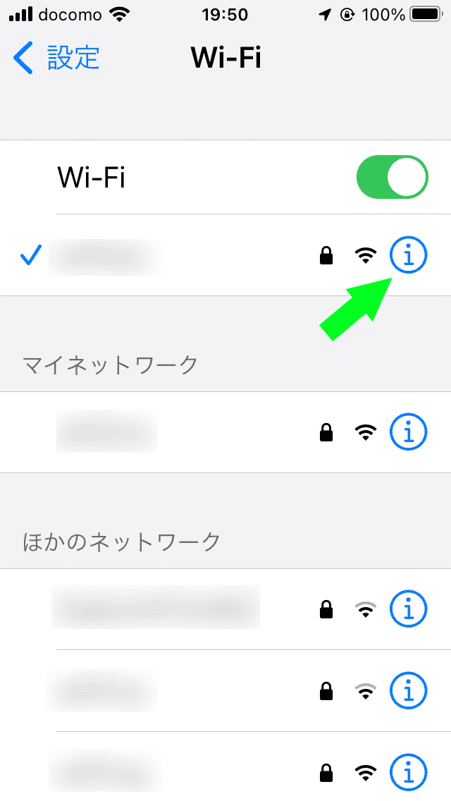{ width="300" }

#### プロキシ構成画面を開く

下にスクロールし「`HTTP プロキシ`」欄の「`プロキシを構成`」に入る。

{ width="300" }

#### プロキシ設定を行う

「`手動`」に切り替え、「`サーバ`」に Windows パソコンの IP 、「ポート」に `8080` を入れる。認証はオフ。（ポートを変えているなら適宜変更）

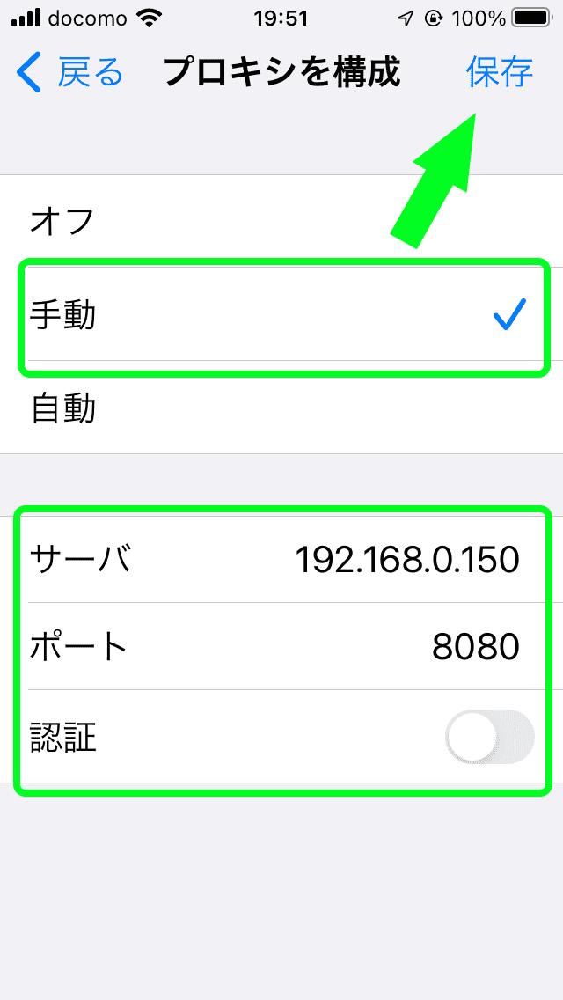{ width="300" }

### 4. iOS に証明書をインストールする

**Safari で** `http://mitm.it/` にアクセスする。アクセス後、以下左のようなインストール画面が表示されたら成功、右のようなエラーが表示されたら失敗。  
エラーが出る場合はプロキシ設定がうまくいっていない。もし時間が経っても接続できなかったら `mitmproxy` を止めてしまっているかもしれないので確認。

|              成功              |             失敗              |
| :----------------------------: | :---------------------------: |
| 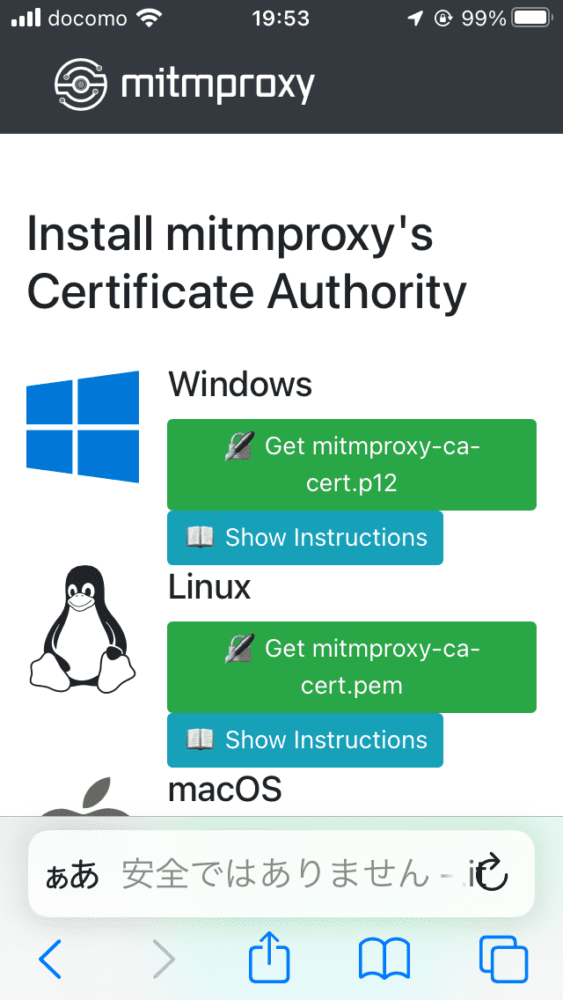 | 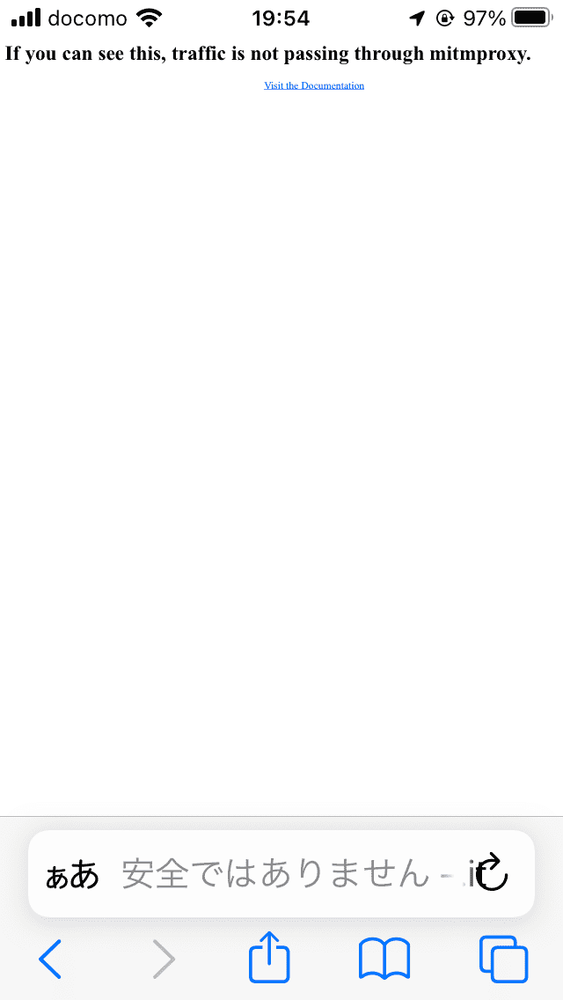 |

成功しインストール画面が表示されていたら、下にスクロールし `iOS` の `Get mitmproxy-ca-cert.pem` をタップする。  
その後、以下の手順でダウンロードを実施する。

|             「許可」をタップ             |          「閉じる」をタップ          |
| :--------------------------------------: | :----------------------------------: |
| 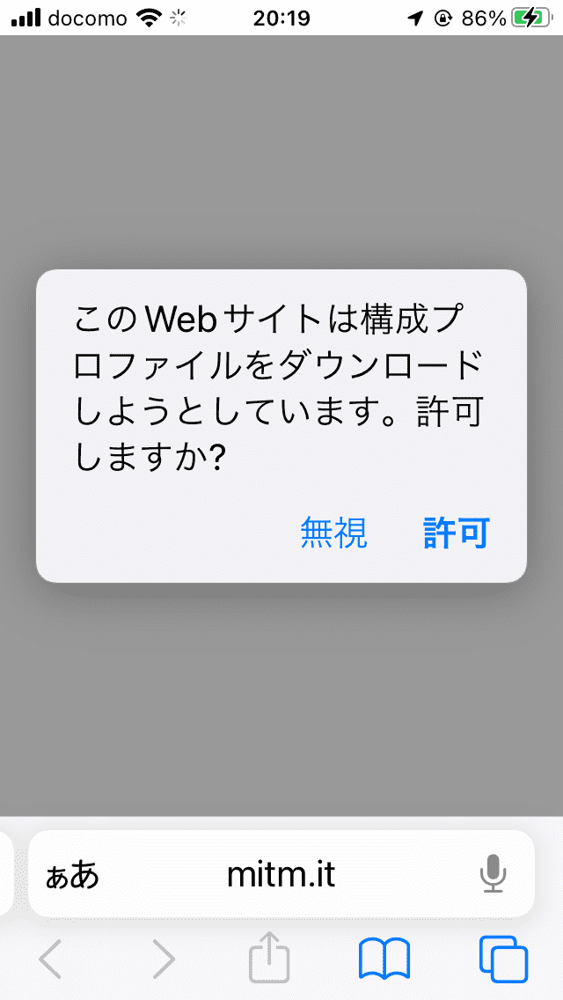 | 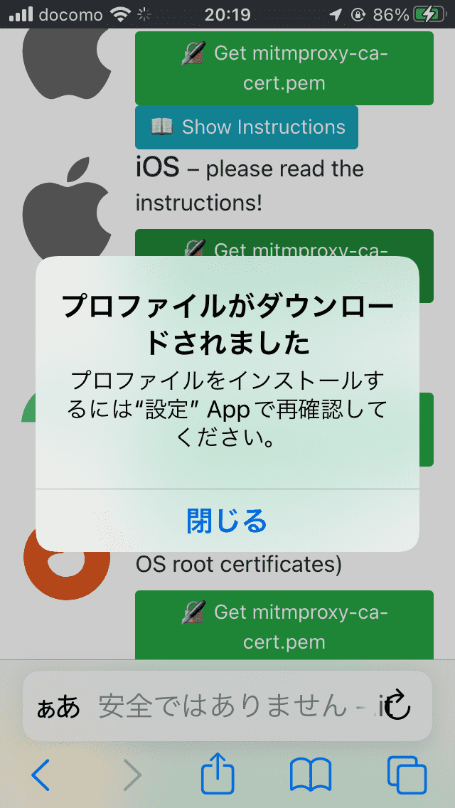 |

さらに、以下の手順でインストールを実施する。

| 設定アプリから「プロファイルがダウンロード済み」をタップ |     「インストールをタップ」      |     「インストール」をタップ     |
| :------------------------------------------------------: | :-------------------------------: | :------------------------------: |
|            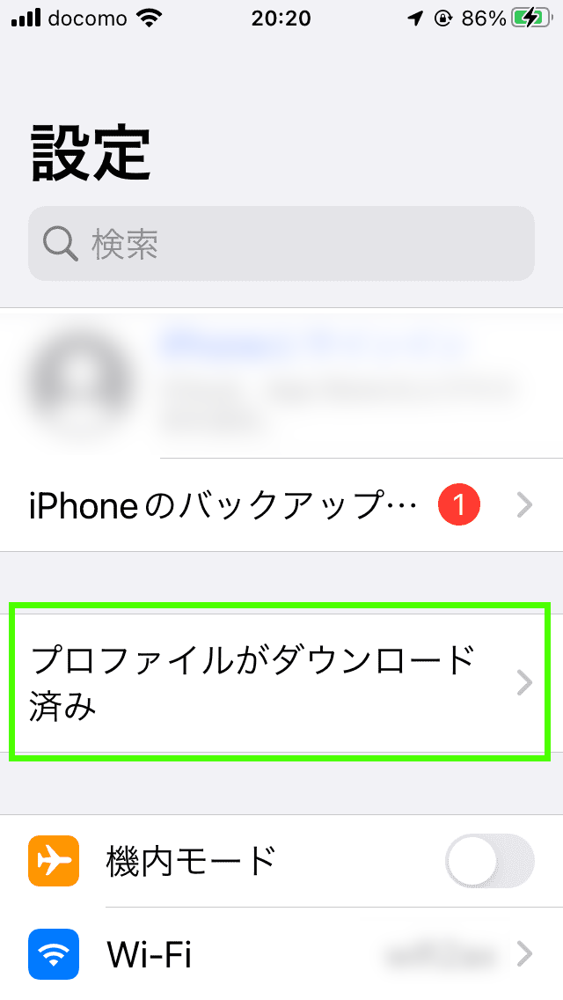             | 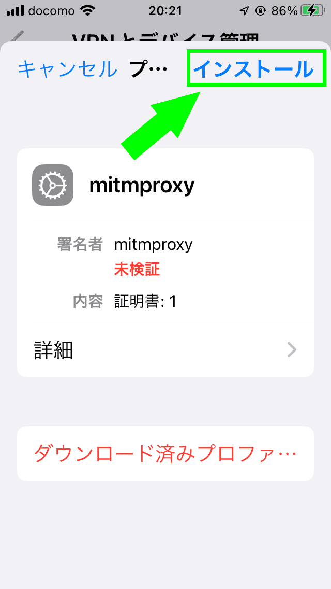 | 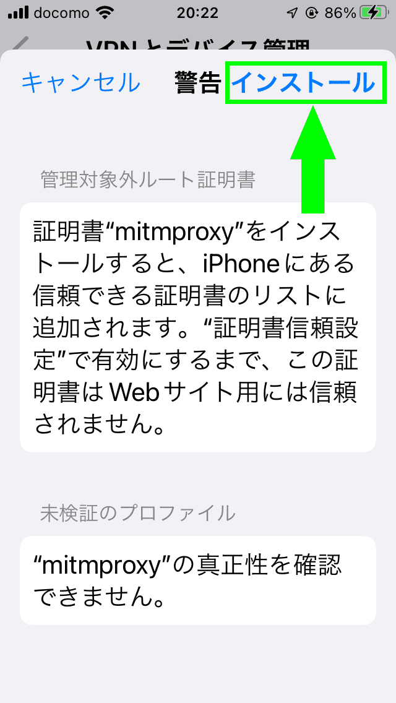 |

インストールをしただけでは有効にならないので、「証明書信頼設定」から有効にする。

設定アプリを開き、「一般」→「情報」→下にスクロールし「証明書信頼設定」→「ルート証明書を全面的に信頼する」で `mitmproxy` をオンにする。

|       `mitmproxy` をオン        |         「続ける」をタップ         |
| :-----------------------------: | :--------------------------------: |
| 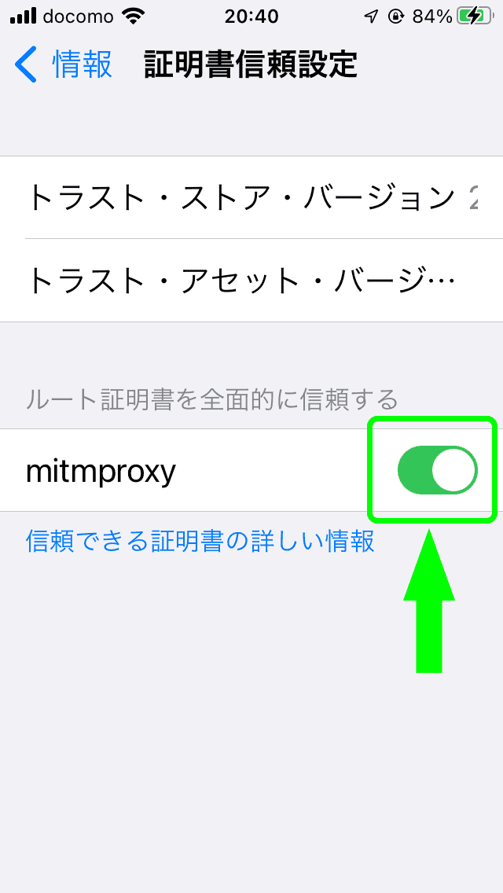 | 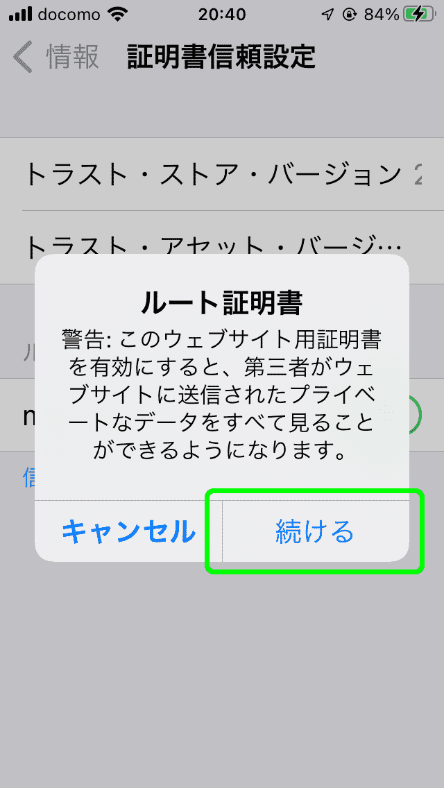 |

### 5. 通信の監視ができるかを確認

iOS 端末から `https://google.com` などに接続し、以下を確認する。

- 問題なく Google のページが表示されることを確認
- `mitmproxy` のコンソールで、それっぽいリクエストを受け付けていたら成功

### 6. mitmweb を試してみる

`mitmproxy` でインタラクティブな CUI でリクエスト・レスポンスを見ることもできるが、正直使いにくいので Web GUI が利用できる `mitmweb` を使ってみる。  
`mitmproxy` を終了したうえで、以下のコマンドを実行。

```bat
mitmproxy
```

ブラウザで `http://localhost:8081` が開くので、あとは適当に眺める。

### 7. スクリプトを用いて全通信をファイルに保存

mitmproxy では「アドオン」という機能で Python を用いてインジェクトできる。

mitmproxy をインストールすると、以下のコマンドが追加される。それぞれのコマンドの機能は以下の通り。

- `mitmproxy`: CUI インタラクティブ表示
- `mitmdump`: コンソールへリクエスト・レスポンスの簡易出力、Web 環境なしで動作
- `mitmweb`: コンソールへリクエスト・レスポンスの簡易出力、Web 環境で動作

すべて `-s` でスクリプトを指定できる。

この機能を用いて、`mitmproxy` を通るすべての通信のリクエストとレスポンスをファイル保存してみる。  
Gist に置いた[mitmproxy-all-write-file.py](https://gist.github.com/book000/ae5685c7903325f76ffefee115ca67e8) を使って以下りように実行する。  
`C:\packet-sniffing` の箇所は保存先なのでお好きな場所に。あまり深いディレクトリだとパス長さ上限に達しやすくなるので浅いほうがオススメ。

```bat
REM venv で mitmdump コマンドが使える状態にしておく

wget https://gist.github.com/book000/ae5685c7903325f76ffefee115ca67e8/raw/885c7bed5c1a85fad53677c74d36509dc4254ef0/mitmproxy-all-write-file.py
SET BASE_DIR=C:\packet-sniffing
mitmdump -s mitmproxy-all-write-file.py
```

実行し適当にリクエストを出すと、以下の構造で保存されていく。

```text
+---req
|   +---google.com
|   |   +---search
|   |   |   \---get
|   |   |          20230430033117.047680.http
+---res
|   +---google.com
|   |   +---search
|   |   |   \---get
|   |   |          20230430033117.047680.txt
```

## Docker で立てる

https://blog.turai.work/entry/20201103/1604403408

## やめるとき

### プロキシ設定の削除

Wi-Fi タブから、接続中の AP のインフォメーションボタンをタップ。下にスクロールし「HTTP プロキシ」欄の「プロキシを構成」に入る。  
「オフ」に切り替え。必要があれば「自動」に切り替え。

### 証明書のアンインストール

設定アプリケーションを開き、一般タブ -> VPN とデバイス管理 -> ダウンロード済みプロファイルの `mitmproxy` をタップ  
「プロファイルを削除」で削除。
