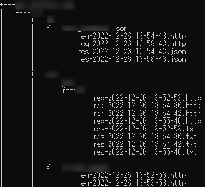

# Fiddler で iOS Packet-Sniffing する

!!! tip "mitmproxy に乗り換えた"
    さまざまな理由から、mitmproxy でのパケットスニッフィングへ乗り換えた。  
    [こちらの記事](https://memo.tomacheese.com/os/ios/packet-sniffing-mitmproxy/)で解説している。

https://qiita.com/tokawa-ms/items/43624d536a44f60882cb

Android でも試そうとしたが、Android 7 からシステム証明書しか信頼できる証明書として使わなくなったらしく、ブラウザしかユーザー証明書を見ないので Android ではルート化せずに Packet Sniffing できないらしい。

https://android-developers.googleblog.com/2016/07/changes-to-trusted-certificate.html

!!! warning "Warning"
    当然ですが、この記事の内容を使って不正に他者の通信を収集・分析したりしないこと。
    もしそれを企んだところで証明書を端末にインストールしなきゃならないので中々難しそうだけども…。

## Environment

- Windows 10 22H2 (Build 19045.2251)
- iPad Pro 3 (11 inch) / iPadOS 16
- Telerik Fiddler Classic v5.0.20211.51073
- FiddlerCertMaker

## Windows にソフトをインストール

以下をインストール。

### Fiddler Classic

安直に Scoop 経由でインストールすると CertMaker インストール時にコケるので、インストーラを使う。  
Fiddler Everywhere なる新しいソフトが出ているが、こちらでは期待する動作はしないと思うので Classic を使う。

https://www.telerik.com/fiddler/fiddler-classic

### CertMaker for iOS and Android

https://www.telerik.com/fiddler/add-ons

## Fiddler の設定

Tools -> Options

### HTTPS タブ

- [x] Capture HTTPS CONNECTs
- [x] Decrypt HTTPS traffic
- [x] Ignore server certificate errors (unsafe)
- Protocols: `<client>;ssl3;tls1.0;tls1.1;tls1.2`

### Connections タブ

- [x] Allow remote computers to connect

## iOS に証明書をインストール

`http://host:8888/` にアクセス、`You can download the FiddlerRoot certificate` からダウンロードしインストールする。

1. `この Web サイトは構成プロファイルをダウンロードしようとしています。許可しますか？` -> `許可`
2. `プロファイルがダウンロードされました` の表示を確認
3. 設定アプリケーションを開き、`一般` タブ -> `VPN とデバイス管理` -> ダウンロード済みプロファイルの `DO_NOT_TRUST_FiddlerRoot` をタップ
4. `インストール` を押下
5. インストールが完了したら、`一般` タブ -> 情報 -> `証明書信頼設定` -> `ルート証明書を全面的に信頼する` -> `DO_NOT_TRUST_FiddlerRoot` をオン
6. ルート証明書をアクティブにすることの警告が出るので、「続ける」

## プロキシ設定

Wi-Fi タブから、接続中の AP のインフォメーションボタンをタップ。下にスクロールし「`HTTP プロキシ`」欄の「`プロキシを構成`」に入る。  
「`手動`」に切り替え、「`サーバ`」に Windows パソコンの IP 、「ポート」に `8888` を入れる。認証はオフ。

## Tips: 通信レスポンスを全部ファイル保存

FiddlerScript タブから、以下のスクリプトを追加する。  
FiddlerScript は JScript.NET らしい…。

一部のサイトでヤバイ長さの URL にアクセスしているサイトがあったので、200 文字を超える場合は無視するようにしている。

```js
static function OnBeforeResponse(oSession: Session) {
    if (!oSession.HTTPMethodIs("CONNECT") && oSession.responseCode == 200) {
        var directoryPath = "/path/to/dir/"
        var reqPath = oSession.hostname + RemoveRight(oSession.PathAndQuery, "?").Replace(":", "-") + "/req-" + oSession.Timers.ClientBeginRequest.ToString().Replace("/", "-").Replace(":", "-") + ".http"
        var resPath = oSession.hostname + RemoveRight(oSession.PathAndQuery, "?").Replace(":", "-") + "/res-" + oSession.Timers.ClientBeginRequest.ToString().Replace("/", "-").Replace(":", "-") + "." + RemoveLeft(oSession.SuggestedFilename, ".")
        if (reqPath.Length >= 200) {
            // パスが200文字を超える場合は無視
            return
        }
        oSession.utilDecodeRequest()
        oSession.SaveRequest(directoryPath + reqPath, false)
        oSession.utilDecodeResponse()
        oSession.SaveResponseBody(directoryPath + resPath)
    }
}

static function RemoveRight(str: String, removeStr: String) {
    var length = str.IndexOf(removeStr)
    if (length < 0) {
        return str
    }
    return str.Substring(0, length)
}

static function RemoveLeft(str: String, removeStr: String) {
    var length = str.IndexOf(removeStr)
    if (length < 0) {
        return str
    }
    return str.Substring(length + 1)
}
```

これを入れて `Save Script` でセーブすると、以下のように出力される。



## やめるとき

### プロキシ設定の削除

Wi-Fi タブから、接続中の AP のインフォメーションボタンをタップ。下にスクロールし「HTTP プロキシ」欄の「プロキシを構成」に入る。  
「オフ」に切り替え。必要があれば「自動」に切り替え。

### 証明書のアンインストール

設定アプリケーションを開き、一般タブ -> VPN とデバイス管理 -> ダウンロード済みプロファイルの `DO_NOT_TRUST_FiddlerRoot` をタップ  
「プロファイルを削除」で削除。
