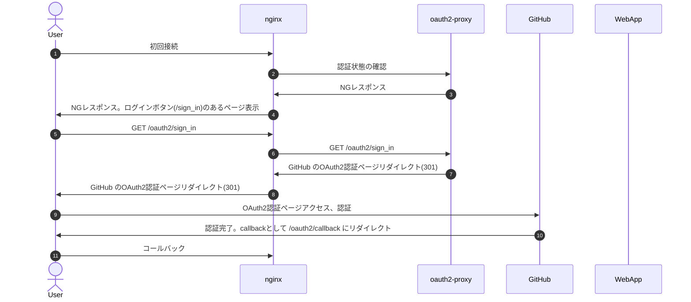

# oauth2-proxy + nginx

nginx と [oauth2-proxy](https://github.com/oauth2-proxy/oauth2-proxy) で既存 Web アプリに OAuth2 の認証機能を持たせてみます。

iOS 系の場合、JavaScript 内で import した JavaScript ファイルの読み込み時に Authorization ヘッダをつけないバグがあるようで([teratail の関連質問](https://teratail.com/questions/252803))、Basic 認証をつけると無限に認証要求するので今回のこれが改善策になったりするかも。

## 環境

- nginx 1.21.4
  - 正確には openresty 1.15.8.1
- oauth2-proxy [v7.4.0](https://github.com/oauth2-proxy/oauth2-proxy/releases/tag/v7.4.0)

## 認証フロー

- 初回接続かどうかは `_oauth2-proxy` Cookie の有無で判断

https://qiita.com/bashaway/items/70d86a11830ae02b8786