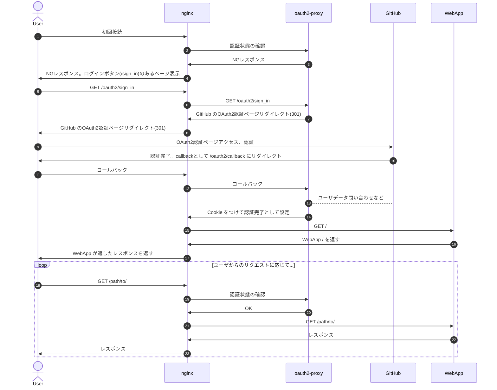

# oauth2-proxy + nginx

nginx と [oauth2-proxy](https://github.com/oauth2-proxy/oauth2-proxy) で既存 Web アプリに OAuth2 の認証機能を持たせてみる。  
今回は GitHub で認証するけど、Google とか OAuth2 の認証機構持っているとこだったらいける。

iOS 系の場合、JavaScript 内で import した JavaScript ファイルの読み込み時に Authorization ヘッダーをつけないバグがあるようで（[teratail の関連質問](https://teratail.com/questions/252803)）、Basic 認証をつけると無限に認証要求するので今回のこれが改善策になったりするかも。

## 環境

- nginx 1.21.4
  - 正確には openresty 1.15.8.1
- oauth2-proxy [v7.4.0](https://github.com/oauth2-proxy/oauth2-proxy/releases/tag/v7.4.0)

今回は、特定のプライベートリポジトリ（`github/example` と仮定）にアクセスできるユーザーのみ認証できるように設定する。

## 認証フロー

こうなっているんだろうと思っている。



- 初回接続かどうかは `_oauth2-proxy` Cookie の有無で判断
- oauth2-proxy は露出する必要がない

## 作業

### GitHub で OAuth アプリケーションを登録

GitHub の [Register a new OAuth application](https://github.com/settings/applications/new) から OAuth アプリケーションを作成。  
`Authorization callback URL` には対象ホストの `/oauth2/callback` を指定。

作成したら、Client ID と `Generate a new client secret` を押下することで生成される Client secret をメモる。

### oauth2-proxy のインストール

一番簡単にやるなら、すでにビルドされているものが [GitHub Release に上がっている](https://github.com/oauth2-proxy/oauth2-proxy/releases) ので、そこから wget なりで落として設置するのが楽。Golang で書かれているので、自分でビルドするにしてもそんなに面倒くさくない。

設置する場所は `/usr/local/bin` とかどこでもよいけど、とりあえず今回は openresty 環境なので `/usr/local/openresty/bin/` に設置。

必要に応じて `sha246sum -c sha256sum.txt` を実行。

### oauth2-proxy の設定

まず、Cookie Secret を生成する必要がある。今回は Python で生成。ほかの手段で作る場合は公式ドキュメントの [Generating a Cookie Secret](https://oauth2-proxy.github.io/oauth2-proxy/docs/configuration/overview#generating-a-cookie-secret) を参照。

```shell
python -c 'import os,base64; print(base64.urlsafe_b64encode(os.urandom(32)).decode())'
```

---

その後、設定ファイルを作る。  
このファイルもどこに作っても良い（公式は `/etc/oauth2-proxy.cfg` に作っている）けど、今回は `/usr/local/openresty/nginx/conf/oauth2-proxy.cfg` に作成。良いかはしらん。

```ini
# oauth2-proxy が待受するホスト名。nginxと通信するだけに使用。4180 がデフォルトだがすでに使っている場合は変更すること
http_address = "127.0.0.1:4180"

# WebApp の URL になるのだが、nginx が処理するのでこのままでいい
upstreams = "http://127.0.0.1/"

# さっき生成した Cookie Secret を設定
cookie_secret = "XXXXXXXXXXXXXXXXXXXXXX"

# OAuth2 アプリケーション登録時に入れた Callback URL を設定
redirect_url = "https://example.com/oauth2/callback"

# OAuth2 の認証に GitHub を使う
provider = "github"

# OAuth2 のスコープ。メールアドレスで認証しない場合でも user:email は必要。プライベートリポジトリの情報を取得するために repo スコープを設定
scope = "user:email,repo"

# 先ほどメモった Client ID と Client Secret を設定
client_id = "XXXXXXXXXXXXXXXXXXXXX"
client_secret = "XXXXXXXXXXXXXXXXXXXXXXX"

# メールアドレスで認証することもできる。今回はなんでもいいので *
email_domains = "*"

# ユーザ名(ログイン名)で認証する場合はここに書き込む
# github_users = []

# アクセスできるか確認するリポジトリを指定
github_repo = "github/example"

# WebApp 側でユーザ情報を使う場合は True。X-USER, X-EMAIL ヘッダーから拾えるらしい
set_xauthrequest = false

# リバースプロキシの裏で動作するので True。X-Real-IP とかの挙動が変わるのだが、nginx で処理している以上あんまり意味ない...
reverse_proxy = true

# 認証後のリダイレクトを許可するドメインとして設定
whitelist_domains = "example.com"

# 認証要求画面に表示されるロゴとかバナーを変更。svgでもpngでも描画できればなんでもいいっぽい。ファイルへのパスを指定(URLではない)
custom_sign_in_logo = "/path/to/example.svg"
banner = "EXAMPLE"

# 認証情報の有効期限を設定
cookie_expire = "3h"
```

上記以外のオプションについては、公式ドキュメントの [Command Line Options](https://oauth2-proxy.github.io/oauth2-proxy/docs/configuration/overview#command-line-options) を参照。  
`--acr-values` の場合、`acr_values` とかに変えて入れれば通るっぽい。実際のキーは [ソースコード](https://github.com/oauth2-proxy/oauth2-proxy/blob/fd2807c091686a2a23f41123e3470a1076e877a0/pkg/apis/options/legacy_options.go#L479-534) を眺めるしかない。（リンク先は特定コミットを指定しているので最新ではない）

---

その後、oauth2-proxy を Systemd に登録して常時稼働させておく。以下を `/etc/systemd/system/oauth2-proxy.service` に書き込み。

```ini
[Unit]
Description=oauth2-proxy
After=syslog.target network.target

[Service]
User=root
Group=root
ExecStart=/usr/local/openresty/bin/oauth2-proxy --config=/usr/local/openresty/nginx/conf/oauth2-proxy.cfg
ExecReload=/bin/kill -HUP
KillMode=process
Restart=always

[Install]
WantedBy=multi-user.target
```

User と Group については、純粋な nginx なら `User=nginx` `Group=nginx` とかにしといた方がよい。

で、OS 起動時の起動登録と起動コマンドを実行。

```shell
sudo systemctl enable oauth2-proxy
sudo systemctl start oauth2-proxy
```

`sudo systemctl status oauth2-proxy` とかで動いているか確認。

### nginx の設定

nginx の設定は環境によってやっかいなのだが、まあ以下のようにルーティングするように設定したい。  
とはいえ参考ページの受け売りに近いのでなんとも言えない...。

- `/oauth2/`: `127.0.0.1:4180` にプロキシ。`X-Auth-Request-Redirect` という認証完了時のリダイレクト先ヘッダーに今のリクエスト URL を入れる
- `/oauth2/auth`: `127.0.0.1:4180` にプロキシ。リクエストボディを投げない (`auth_request` にはボディを含まないから...とかいうけど、よくわからん...)
- `/oauth2/sign_out`: `127.0.0.1:4180` にプロキシ。`X-Auth-Request-Redirect` という認証完了時のリダイレクト先ヘッダーに `/?sign_out` を指定
- `/`: `auth_request` で `/oauth2/auth` を認証エンドポイントとして設定

というわけで、まあ以下のような感じになる。

```conf
server {
  location /oauth2/ {
    proxy_pass http://127.0.0.1:4180;
    proxy_set_header Host $host;
    proxy_set_header X-Scheme $scheme;
    proxy_set_header X-Auth-Request-Redirect $request_uri;
  }

  location /oauth2/auth {
    proxy_pass http://127.0.0.1:4180;
    proxy_set_header Host $host;
    proxy_set_header X-Scheme $scheme;
    proxy_set_header X-Auth-Request-Redirect $request_uri;

    # よくわからん...
    proxy_set_header Content-Length "";
    proxy_pass_request_body off;
  }

  location /oauth2/sign_out {
    proxy_pass http://127.0.0.1:4180;
    proxy_set_header Host $host;
    proxy_set_header X-Scheme $scheme;
    proxy_set_header X-Auth-Request-Redirect "https://example.com?sign_out";
  }

  location / {
    auth_request /oauth2/auth;

    # set_xauthrequest を True にしていて、WebApp 側でユーザ情報を拾うなら以下を有効化
    # auth_request_set $user $upstream_http_auth_request_user;
    # auth_request_set $email $upstream_http_x_auth_request_email;
    # proxy_set_header X-User $user;
    # proxy_set_header X-Email $email;

    # Access Token を WebApp で使うなら以下を有効化 (X-Access-Token ヘッダに入る)
    # auth_request_set $token $upstream_http_x_auth_request_access_token;
    # proxy_set_header X-Access-Token $token;

    # WebApp に投げる
    proxy_pass http://127.0.0.1:1234/;
    # もしくはは静的ファイルを配信
    # try_files $uri $uri/ =404;
  }
}
```

参考ページで上げている nginx の設定はどこからかの流用らしいのだけど、公式のリポジトリにある [nginx.conf](https://github.com/oauth2-proxy/oauth2-proxy/blob/fd2807c091686a2a23f41123e3470a1076e877a0/contrib/local-environment/nginx.conf) は全然違うし、なんなんだろう...。動くことは動くのだけど。

`/sign_out` でログアウトさせるときに `?sign_out` なんてクエリをつけているのは、クエリがないとなんかのキャッシュが動くのか認証後のページが出るから。

## 参考

- https://oauth2-proxy.github.io/oauth2-proxy/docs/
- https://developer.okta.com/blog/2022/07/14/add-auth-to-any-app-with-oauth2-proxy#configure-nginx
- https://qiita.com/bashaway/items/70d86a11830ae02b8786
