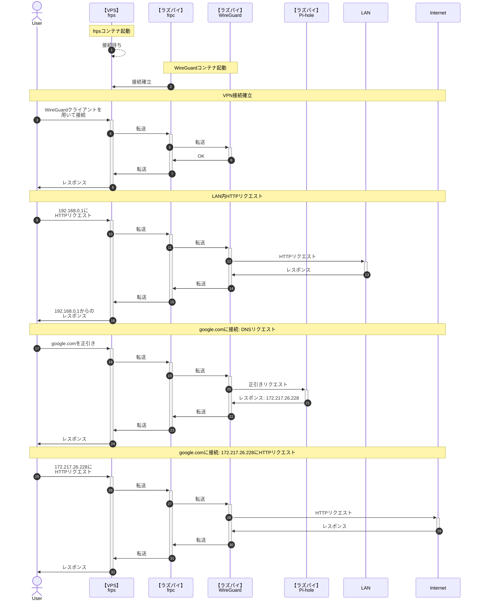

# Raspberry Pi で WireGuard + VPS

Raspberry Pi 4 model B で VPN アプリケーションである [WireGuard](https://www.wireguard.com/) を立て、[ConoHa VPS](https://www.conoha.jp/vps/) を経由して VPN 環境を構築します。

**自宅ルーターのポートを開けずに** 自宅外から自宅内のサーバや PC にアクセスしたい、フリー Wi-Fi でもある程度安全に通信できる環境を作りたいと思い構築しています。

## 期待する結果

最終的に、以下のように動作するよう構成します。

## 環境

Raspberry Pi と VPS 間のポートフォワーディングに [fatedier/frp](https://github.com/fatedier/frp) を利用します。  
その上で、DockerHub にあるもののうち **ユーザ数がある程度いて**、**GitHub Actions などで fatedier/frp のアップデートに追従しているもの** として [snowdreamtech/frp](https://github.com/snowdreamtech/frp) を選定しています。

Pi-hole と frp の利用には Docker を利用していますが、WireGuard は Docker 内で動作させません。  
（[linuxserver/wireguard](https://hub.docker.com/r/linuxserver/wireguard) を試したのですが、接続後 1 分程経過したタイミングでコンテナ内から LAN への通信がタイムアウトするようになりやめました）

- Raspberry Pi 4 model B
  - Raspberry Pi OS 64bit (Bullseye)
  - WireGuard 1.0.20210223-1
  - [snowdreamtech/frps](https://hub.docker.com/r/snowdreamtech/frps) 0.47.0
  - [pi-hole/pi-hole](https://hub.docker.com/r/pi-hole/pi-hole) 2023.02.2
- ConoHa VPS
  - 512 MB プラン
  - Ubuntu 20.04.5 LTS
  - [snowdreamtech/frpc](https://hub.docker.com/r/snowdreamtech/frpc) 0.47.0

## 作業

1. WireGuard のインストール
2. frps の構築
3. frpc の構築
4. Pi-hole の構築

### 1. WireGuard のインストール

### 2. frps の構築

### 3. frpc の構築

### 4. Pi-hole の構築