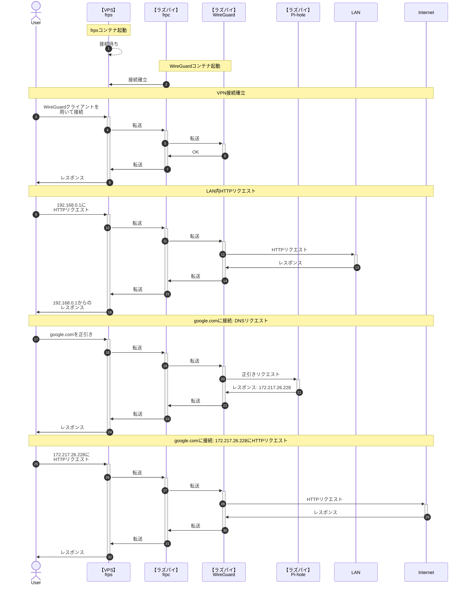

# Raspberry Pi で WireGuard + VPS

Raspberry Pi 4 model B で VPN アプリケーションである [WireGuard](https://www.wireguard.com/) を立て、[ConoHa VPS](https://www.conoha.jp/vps/) を経由して VPN 環境を構築します。

**自宅ルーターのポートを開けずに** 自宅外から自宅内のサーバや PC にアクセスしたい、フリー Wi-Fi でもある程度安全に通信できる環境を作りたいと思い構築しています。

## 期待する結果

最終的に、以下のように動作するよう構成します。



## 環境

Raspberry Pi と VPS 間のポートフォワーディングに [fatedier/frp](https://github.com/fatedier/frp) を利用します。  
その上で、DockerHub にあるもののうち **ユーザ数がある程度いて**、**GitHub Actions などで fatedier/frp のアップデートに追従しているもの** として [snowdreamtech/frp](https://github.com/snowdreamtech/frp) を選定しています。

Pi-hole と frp の利用には Docker を利用していますが、WireGuard は Docker 内で動作させません。また、PiVPN を利用しません。
（[linuxserver/wireguard](https://hub.docker.com/r/linuxserver/wireguard) を試したのですが、接続後 1 分程経過したタイミングでコンテナ内から LAN への通信がタイムアウトするようになりやめました。PiVPN を利用しない理由は途中のネットワークデバイス選択画面で Docker ネットワークが大量に表示され進めなくなったからです）

もちろん、frp や Pi-hole を Docker で構築せずホスト OS にインストールしても構いません。

- Raspberry Pi 4 model B
  - Raspberry Pi OS 64bit (Bullseye)
  - WireGuard 1.0.20210223-1
  - [snowdreamtech/frps](https://hub.docker.com/r/snowdreamtech/frps) 0.47.0
  - [pi-hole/pi-hole](https://hub.docker.com/r/pi-hole/pi-hole) 2023.02.2
  - イーサネットの NIC として `eth0` を利用
- ConoHa VPS
  - 512 MB プラン
  - Ubuntu 20.04.5 LTS
  - [snowdreamtech/frpc](https://hub.docker.com/r/snowdreamtech/frpc) 0.47.0

## 作業

1. frps の構築
2. WireGuard のインストール
3. frpc の構築
4. Pi-hole の構築

### 1. frps の構築

まずはじめに、VPS 側の frp サーバソフトウェアである frps のインストール作業をします。

VPS 上の任意の場所に以下の `docker-compose.yml` を作成します。

```yaml
services:
  frps:
    image: snowdreamtech/frps
    container_name: frps
    volumes:
      - ./frps.ini:/etc/frp/frps.ini
    ports:
      - 7000:7000
      - 12345:12345/udp
    restart: always
```

その後、`docker-compose.yml` を置いた同じディレクトリに `frps.ini` を作成し以下を設定します。

```ini
[common]
bind_port = 7000
token = "任意の文字列"
```

`token` はポートフォワーディング時の認証トークンとなるので、固有のある程度長い推測不能な文字列にしてください。

設定を終えたら、`docker compose up --build -d` で立ち上げます。  
`7000` ポートの開放も忘れずに。

!!! note "備考"
    最小のコード量で動作するように記事を書いているので、`7000` 番ポート以外への変更作業や frps のダッシュボードの設定などは記述していません。必要に応じて実施してください。

### 2. WireGuard のインストール

VPN サーバとなる WireGuard を Raspberry Pi 4 model B にインストールします。  
WireGuard はサーバにもクライアントにもなりうるので「サーバ」という表記が正しいのかは難しいところですが…。

WireGuard のインストールでは、以下の手順を踏んでいきます。

1. `sysctl` の設定
2. APT で WireGuard をインストール
3. サーバサイド鍵ペアの作成
4. WireGuard の設定ファイル作成
5. クライアントに配布する接続設定ファイルの作成
6. WireGuard の起動

このうち、4, 5, 6 はクライアントを追加するごとに実施するのでシェルスクリプトで再利用可能にします。

#### sysctl の設定

追加設定をしない限り、異なる NIC 間でパケットのやり取りをすることはできません。WireGuard はデフォルトで `wg0` という NIC を追加するので、これと `eth0` 間でパケット転送ができない場合 VPN を繋いでも LAN ネットワークやインターネットと通信できません。  
（という理解なのですが、間違ってたらすみません）

### 3. frpc の構築

### 4. Pi-hole の構築

## クライアントの設定

### iOS

### Android

### Windows

## トラブルシューティング
