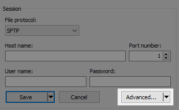
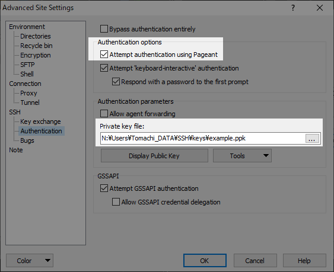

# 自動で Pageant する

WinSCP で SFTP をするとき、SSH 認証でパスフレーズ付き公開鍵認証の場合、毎回の接続時にパスフレーズを問われて面倒なので Pageant を使ってある程度自動化してしまおうというやつ。

## 環境

- Windows 10 22H2 (Build 19045.2364)
- WinSCP 5.21.6 (Build 12913)
- Pageant 0.78

---

- SSH 認証でパスフレーズ付き公開鍵認証でログインできるサーバーがあるものとする
- 公開鍵は何らかの手段で ppk ファイルに変換してあるものとする
- ppk ファイルは例として `C:\Users\user\keys\example.com.ppk` に保存しているものとする（任意に変更可能）
- 利用しているコンピュータに適切なセキュリティ対策が施されており、ppk ファイルおよび本記事で作成するファイルは自分自身以外がアクセスできないように対策できるものとする
  - パスフレーズを平文で書くので…。

## 作業

1. `shell:startup` に Pageant のショートカットを設置し、Windows の起動時に Pageant が起動するようにする
2. vbs ファイル（VBScript）を作成し、Pageant に ppk ファイルを登録するスクリプトを作成する
3. 動作するか確認

### Windows の起動時に Pageant を起動させる

putty のインストール先にある `PAGEANT.EXE` のショートカットを作成し、`shell:startup` に入れる。

### Pageant に ppk ファイルを登録するスクリプトを作成

拡張子 vbs のファイルを適切な場所に作成し、以下のスクリプトを書き込む。  
書き込む際、`[変更箇所]` として示した以下の 2 つを修正。

- ppk ファイルへのパス
- 鍵のパスフレーズ

!!! tip "例: example.com.vbs"

    ```vbscript linenums="1" hl_lines="7 11"
    Option Explicit

    Dim objWshShell
    Set objWshShell = WScript.CreateObject("WScript.Shell")

    ' [変更箇所] ppk ファイルへのパス
    objWshShell.Run "pageant.exe C:\Users\user\keys\example.com.ppk"

    Dim passPhrase
    ' [変更箇所] 鍵のパスフレーズ
    passPhrase = "abcdefghijklmnopqrstuvwxyz"

    Dim intProcID
    intProcID = GetProcID("pageant.exe")

    ' pageant.exe プロセスを探す。プロセス ID が 0 だった場合は当該プロセスが見つからない
    If intProcID = 0 Then
        MsgBox "Pageant is not working...", vbInformation, "AutoPageant"
        WScript.Quit
    End If

    WScript.Sleep 500

    ' Pageant にその ppk ファイルを登録していなくてその鍵にパスフレーズが必要な場合、パスフレーズ入力ウィンドウが開く
    If objWshShell.AppActivate("Pageant: Loading Encrypted Key") Then
        objWshShell.SendKeys passPhrase & "{ENTER}"
        WScript.Sleep 500
        ' 入力に失敗する可能性があるので、入力後にもまだウィンドウが開いている場合はリトライする
        If objWshShell.AppActivate("Pageant: Loading Encrypted Key") Then
            objWshShell.SendKeys passPhrase & "{ENTER}"
        End If
    Else
        MsgBox "Failed to register with Pageant. Already registed?", vbInformation, "AutoPageant"
        WScript.Quit
    End If

    ' 2回リトライしてもウィンドウが開いたままの場合は失敗としてメッセージボックスを表示する
    If objWshShell.AppActivate("Pageant: Loading Encrypted Key") Then
        MsgBox "Failed to register with Pageant.", vbInformation, "AutoPageant"
        WScript.Quit
    End If

    ' 登録完了としてポップアップを表示。ポップアップは1秒後に自動で消える
    objWshShell.PopUp "Registration to Pageant is complete. This message closes automatically after 1 second.", 1

    ' プロセス名をもとにプロセス ID を取得する。指定したプロセスが存在しない場合は 0 を返す
    Function GetProcID(ProcessName)
        Dim Service
        Dim QfeSet
        Dim Qfe
        Dim intProcID

        Set Service = WScript.CreateObject("WbemScripting.SWbemLocator").ConnectServer
        Set QfeSet = Service.ExecQuery("Select * From Win32_Process Where Caption='" & ProcessName & "'")

        intProcID = 0
        For Each Qfe in QfeSet
            intProcID = Qfe.ProcessId
            Exit For
        Next
        GetProcID = intProcID
    End Function
    ```

### 動作するか確認

まず、WinSCP でサーバー設定をする。



`New Site` から新規にサイトを追加し、`Host name`、`Port number`、`User name` を入力する。`Password` については公開鍵のみで認証する場合は不要。



`Advanced Site Settings` が開くので、`SSH` -> `Authentication` にある以下の項目を修正する。

- Authentication options
  - [x] Attempt authentication using Pageant
- Authentication parameters
  - Private key file: ppk ファイルを指定。ppk ファイルではない公開鍵を持っている場合は読み込もうとすることで ppk ファイルに変換する画面が出てくる

次に、作成した vbs ファイルを用いて自動的に Pageant に公開鍵を登録するため、作成した vbs ファイルをダブルクリックする。  
パスフレーズの入力画面が表示されるが、VBScript によって自動で入力される。

WinSCP でログイン試行してみるとパスフレーズの入力を求められずにログインできる。
