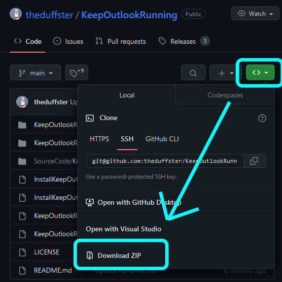

# Outlookの閉じるボタンを押しても最小化させる

Outlook は Outlook そのものを閉じてしまうとメールの受信通知すらこないので、最小化してタスクバーに残しておく必要がある。大抵閉じるボタンを無意識に押して、あとで困ることの方が多い。

アドインを使って解決できるのだが、Outlook のアドインが一筋縄では入らなかったのでメモっておくことにする。

なお、Thunderbird では [Minimize on Close](https://addons.thunderbird.net/ja/thunderbird/addon/minimize-on-close/) というアドオンを入れるだけで解決可能。

参考元: [How to make Outlook 2010 minimize when I try to close it? - superuser.com](https://superuser.com/questions/189905/how-to-make-outlook-2010-minimize-when-i-try-to-close-it/275244#275244)

## 環境

以下の環境で動作確認済み。

- Windows 10 22H2 (Build 19045.2965)
- Microsoft Outlook 2021 MSO 2304 (Build 16.0.16327.20220) 64 bit
- Microsoft Visual C++ 2010 SP1 Redistributable Package 10.0
- theduffster/KeepOutlookRunning v1.0 (2022/11/05)

## 作業

流れとしては以下のとおり。

1. Microsoft Visual C++ 2010 SP1 Redistributable Package をインストール
2. theduffster/KeepOutlookRunning リポジトリの Zip ファイルをダウンロードし、展開
3. bat ファイルを実行
4. Outlook を再起動

## 1. Microsoft Visual C++ 2010 SP1 Redistributable Package をインストール

[Microsoft Visual C++ 2010 Service Pack 1 再頒布可能パッケージ MFC のセキュリティ更新プログラム](https://www.microsoft.com/ja-jp/download/details.aspx?id=26999) から `vcredist_x64.exe` をダウンロードして、インストールする。

## 2. theduffster/KeepOutlookRunning リポジトリの Zip ファイルをダウンロードし、展開



[theduffster/KeepOutlookRunning](https://github.com/theduffster/KeepOutlookRunning) をブラウザで開く。  
その後画像のように `<>` をクリック、`Download ZIP` でリポジトリの Zip ファイルをダウンロードし、展開する。

## 3. bat ファイルを実行

すでに Outlook を起動していた場合はいったん終了しておく。

展開した `InstallKeepOutlookRunning-64bit.bat` を実行する。コマンドプロンプトが開き、以下が表示されることを確認。

```text
___________________________________________________________
Welcome to the KeepOutlookRunning (64 bit) installer batch
___________________________________________________________
This batch will install KeepOutlookRunning (64 bit) for the active user only
No system files will be touched
___________________________________________________________
IMPORTANT: Do not run this install batch from the zip file
           directly. It won't work. Please extract the zip
           file contents to a folder and run it from there.
           Must CD to the unzipped folder for this to work.
ECHO は <OFF> です。
___________________________________________________________
Would you like install KeepOutlookRunning (64 bit)?(Y/N)
Type input:
```

`Type input:` とあるので、インストールして構わなければ ++y++ を打ち込んで ++enter++。

`KeepOutlookRunning was installed` と表示されたら成功。

## 4. Outlook を再起動する

Outlook を起動する。以下の 2 点を確認する。

- `ファイル` -> `オプション` -> `アドイン` タブ -> `アクティブなアプリケーション アドイン` に `Keep Outlook Running COM Addin` があることを確認。
- Outlook の閉じるボタンを押したときにタスクバーにアイコンが残り続けることを確認。

以上が確認できれば、インストールは成功。
