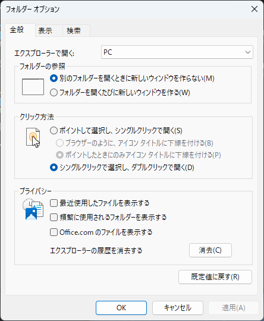
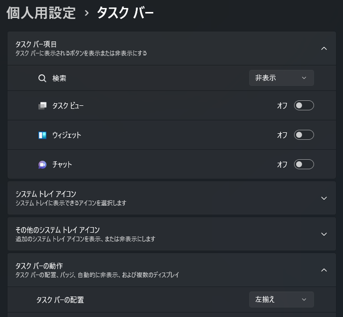
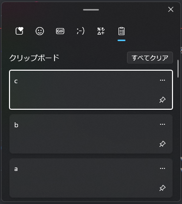
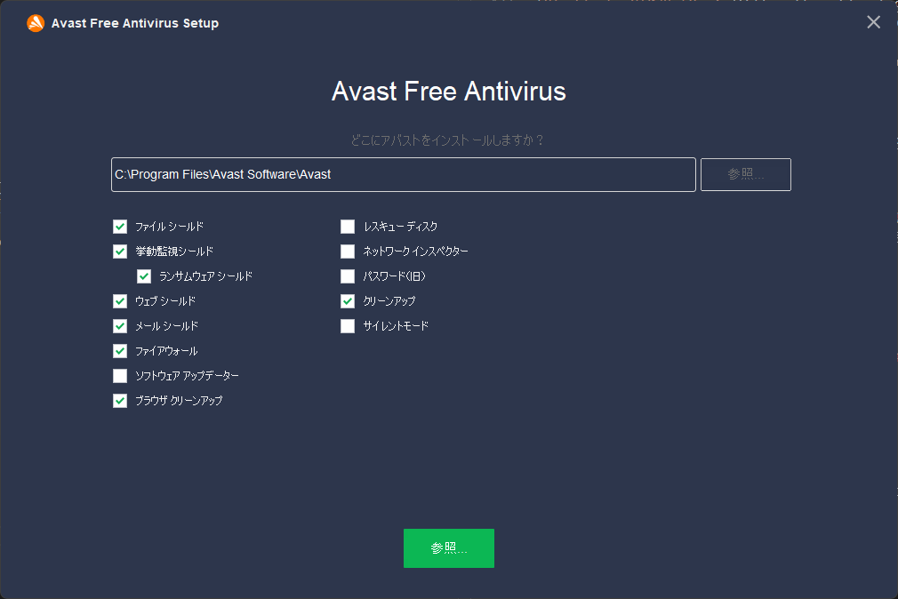
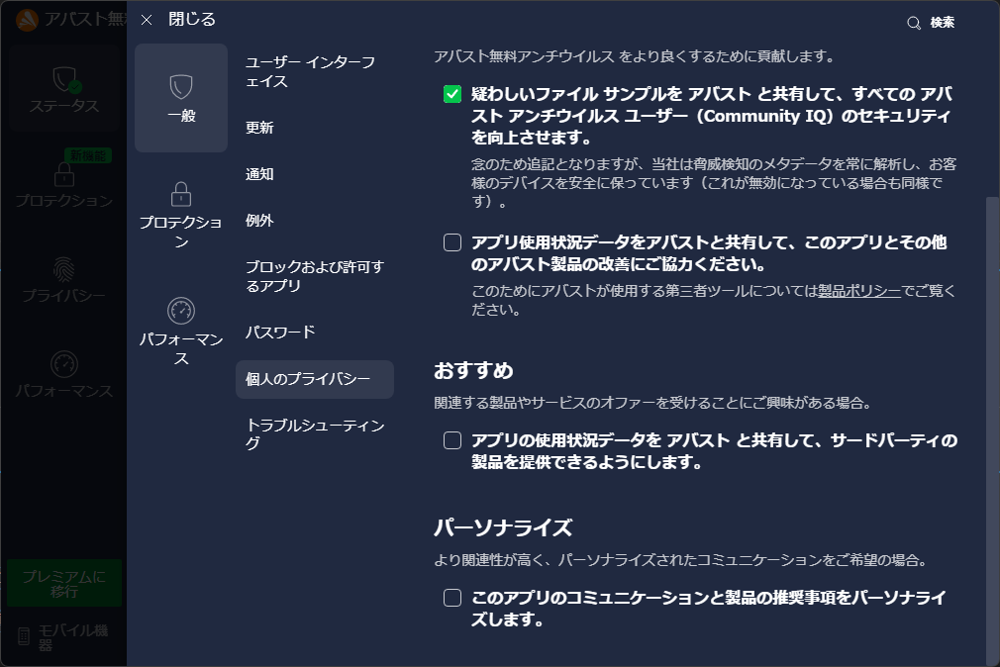
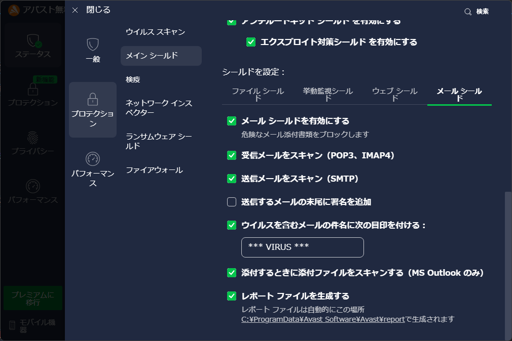
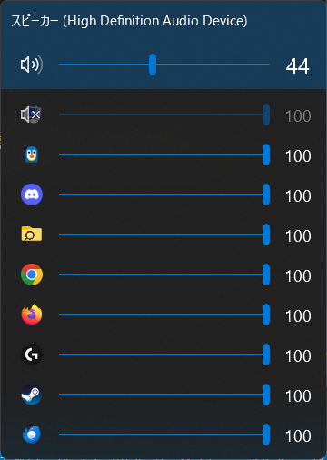

# 自分用PCセットアップ関連メモ

!!! warning "注意事項"
    本メモの内容に起因して生じた、あらゆる損害や障害について一切の責任を負いません。

## 環境

- Windows 11
  - Home 22H2 (Build 22621.1702)
  - Pro 22H2 (Build 22621.1192)

## クリーンインストールをする前に…

[初期化前に行う作業](before-reset.md) を必ず確認し実施。

## インストールメディアの作成

Windows のクリーンインストールにあたり、インストールメディア（USB メモリ）を作成しておくと良い。  
（回復オプションからリセットできるが、パーティション全部消して入れ直した方が綺麗になると思っている）

Microsoft の [Windows 11 をダウンロードする](https://www.microsoft.com/ja-jp/software-download/windows11) にアクセスし、`Windows 11 のインストールメディアを作成する` からツールをダウンロード。  
ダウンロードしたメディア作成ツールを実行して、インストールメディアを作成する。

## BIOS/UEFI の設定

参考: https://michisugara.jp/csm_secureboot

Windows 11 ではセキュアブートが必須になった。BIOS（UEFI）にてこの設定を有効化する必要があるのだが、どういう設定をすればいいか厄介なので一応メモ。

- CSM を無効にする（Windows 7 以下が実行不可になる？）
- Secure Boot を有効にする（起動時にデジタル署名をチェックする）
- 間違っても両方を有効にはしない
- ASUS のマザーボードなら起動設定（Boot）にある

## インストール

参考: https://www.ask-corp.jp/guide/pc-diy-part4.html

PCを起動する前に、Windows をインストールしたいストレージ以外のケーブルを外しておく。  
パーティションを削除するときにどのパーティションかわからなくなるので、絶対に外しておくのが吉。

BIOS/UEFI に入り、起動順を変えてインストールメディアとして作成した USB メモリで起動する。Windows 11 のインストーラーが起動するはず。  
インストーラーが起動したら、以下の手順でインストールする。

1. `今すぐインストール` をクリック
2. `Windows のライセンス認証` の画面に移動する。クリーンインストールの場合ハードウェアの情報を使って認証するので、`プロダクトキーがありません` をクリック
3. インストールするオペレーティングシステムを選ぶ画面になる。正しいエディションを選ぶ
4. ライセンス条項に同意して `次へ`
5. 下の `カスタム` を選ぶ
6. すべてのパーティションを削除（パーティションを選んで `削除`）し、1 つの `割り当てられていない領域` にする。
7. `割り当てられていない領域` を選択した状態で、`新規` をクリックしパーティションを作成する（この手順要らないかも）
8. Windows 11 のインストールが始まる

## インストール時の初期設定

参考: https://a-zs.net/win11_msaccountkaihi/

Windows 11 のインストール処理が終わると、国や地域を選ぶ画面が表示される。

Microsoft アカウントを利用するならこのまま進んでも良いが、ローカルアカウントを利用するなら以下の手順を踏む（Windows 11 Home でも実施可能）

1. ++shift+f10++ でコマンドプロンプトを起動する
2. `oobe\ByPassNRO.cmd` と打ち込み、実行する。自動で再起動される
3. LAN ケーブルを刺している場合は抜く
4. セットアップを進める（国の設定とキーボードレイアウトの設定の後）と、ネットワークに接続することを要求される。この画面で、`インターネットに接続していません` というボタンが利用できるのでこれをクリック
5. `今すぐ接続して、デバイスをすぐに使い始めましょう` という画面が出るが、`制限された設定で続行` をクリック

その後、以下の設定が表示されるので適宜進める。

- `このデバイスを使うのはだれですか？`: ここで入力した文字列がユーザー名となる。大文字小文字が識別され、ユーザーフォルダともなるので注意。アルファベットで小文字を推奨
- `確実に覚えやすいパスワードを作成します`: ログイン時のパスワードを設定
- 秘密の質問: 適宜設定
- `デバイスのプライバシー設定の選択`: お好きにだが、すべてオフ（拒否）で良い

デスクトップが表示されれば、Windows 11 のインストールと初期設定は完了。  
この後は利便性を上げるための設定をする。

## Windows Update の実施

デバイスドライバーなどの関係で、この段階で Windows Update をしておくのが良い。  
Windows Update で入らないドライバーは別途インストールを行う。

## Windows を使う上での推奨設定

Windows を使う上での個人的なおすすめ設定を行う。

### デバイス名の変更

`システムのプロパティ`（`SystemPropertiesComputerName.exe`）の `コンピューター名/ドメイン名の変更` で変更する。  
変更後は再起動が必要で、デバイス名は Firefox が利用するので最初にやったほうがよい。

コマンドラインからも変更可能。**管理者権限で** PowerShell を開いて以下を実行。

```powershell
wmic computersystem where name="%computername%" call rename name="<COMPUTER-NAME>"
wmic computersystem where name="%computername%" call joindomainorworkgroup name="<WORKSPACE-NAME>"
```

### ブラウザのインストール

Chrome や Firefox など、お好きなブラウザをインストールする。以下はインストールページへのリンク。

- [Chrome](https://www.google.com/intl/ja_jp/chrome/)
- [Firefox](https://www.mozilla.org/ja/firefox/windows/)

### エクスプローラの設定

まず、隠しフォルダ・ファイルと拡張子を表示する設定をする。

エクスプローラを開き、上部ナビゲーションバーの `表示` から `表示` を開き、以下の設定をする。

- [x] `ファイル名拡張子`
- [x] `隠しファイル`


さらに、`・・・` から `オプション` を開き、以下の設定も行う。

- `全般` タブ
  - `エクスプローラーで開く`: `PC`
  - `プライバシー`
    - [ ] `最近使用したファイルを表示する`
    - [ ] `頻繁に使用されるフォルダーを表示する`
    - [ ] `Office.com のファイルを表示する`



### タスクバーの設定

設定アプリを開き、`個人用設定` から `タスクバー` を開き、以下の設定をする。

[`個人用設定 -> タスクバー` を開く](ms-settings:taskbar){ .md-button }

- `タスクバー項目`
  - `検索`: `非表示`
  - `タスク ビュー`: `オフ`
  - `ウィジェット`: `オフ`
  - `チャット`: `オフ`
- `タスク バーの動作`
  - `タスク バーの配置`: `左揃え`



### スタートメニューのカスタマイズ

設定アプリにて、`個人用設定` → `スタート` に進み、以下を変更。

[`個人用設定 -> スタート` を開く](ms-settings:personalization-start){ .md-button }

- `レイアウト`: **さらにピン留めを表示する**
- `最近追加したアプリを表示する`: オフ
- `よく使うアプリを表示する`: オフ
- `最近開いた項目をスタート、ジャンプ リスト、ファイル エクスプローラーに表示する`: オフ
- `ヒント、ショートカット、新しいアプリなどのおすすめを表示する`: オフ
- `スタート画面にアカウント関連の通知を時々表示する`: オフ


### テーマ・色の設定

設定アプリを開き、`個人用設定` から `テーマ` や `色` を選び、好みのテーマや色を選択する。

- [`個人用設定 -> テーマ` を開く](ms-settings:themes){ .md-button }
- [`個人用設定 -> 色` を開く](ms-settings:colors){ .md-button }

### ユーザーフォルダの移動

C ドライブにあるユーザーフォルダを別ドライブに移動する場合、以下の手順を踏む。

GUI から変更する場合は、ユーザーフォルダを開き 1 つずつ `プロパティ` -> `場所` -> アドレスを変更 -> `OK` -> `移動` できる。

1. `C:\Users\<User>` を開く（`%HOMEDRIVE%%HOMEPATH%`）
2. 後述するフォルダのプロパティを開く
3. `場所` タブを開く
4. 保管場所のアドレスを変更する
5. `OK` をクリック
6. `フォルダーの作成` 画面が開くので、`はい` をクリック
7. `フォルダーの移動` 画面が開くので、`はい` をクリック

移動対象のフォルダは以下のとおり。

- `アドレス帳`
- `お気に入り`
- `ダウンロード`
- `デスクトップ`
- `ドキュメント`
- `ピクチャ`
- `ビデオ`
- `ミュージック`
- `リンク`
- `保存したゲーム`
- `検索`

### クリップボードの履歴機能を有効化

++win+v++ を押すことで、以下のようなクリップボード履歴機能が利用できる。



この機能は有効化しておかないと利用できないので、++win+v++ を押して機能の有効化をしておく。

### ウインドウを選ぶ時の全画面プレビューを無効化

デフォルトの設定では、タスクバーからウィンドウを選ぶだけでほかのウィンドウが透明化される。  
個人的にはこの挙動はウザいので、機能を無効にする。

1. `Windows のデザインとパフォーマンスの調整`（`SystemPropertiesPerformance.exe`）を開く
2. `視覚効果` タブにて、`プレビューを有効にする` のチェックボックスを **オフ** にする

### Windows の通知サウンドを切る

Windows はことあるごとに通知音を鳴らしてうるさいので、Windows の通知音を鳴らさないようにする。

1. `システム サウンドの変更` を開く  
   この設定は、[設定アプリの `システム -> サウンド`](ms-settings:sound) の一番下にある `サウンドの詳細設定` からアクセスできる
2. `サウンド` タブを開く
3. `サウンド設定` を `サウンドなし` に変更
4. `OK` で保存

### 通信アクティビティの設定

Discord などで通話中にほかの音量が下がってしまう問題を解決するため、通信アクティビティで音量を変更しないようにする。

1. `システム サウンドの変更` を開く
2. `通信` タブを開く
3. `Windows が通信アクティビティを検出したとき:` で `何もしない` を選択
4. `OK` で保存する

### モニターのリフレッシュレート設定

モニターが 144 Hz などの高いリフレッシュレートに対応している場合、設定を変更する必要がある。

設定アプリを開き、`システム` から `ディスプレイ` を開き、以下の設定をする。

[`システム -> ディスプレイ` を開く](ms-settings:display){ .md-button }

1. 対象のモニターを選択し、下にスクロールし `ディスプレイの詳細設定` をクリック
2. `リフレッシュ レートの選択` にて、選択可能な一番高いリフレッシュレートを選ぶ

### 起動時の「PCのセットアップを完了しましょう」を止める

- 参考: https://atmarkit.itmedia.co.jp/ait/articles/2403/18/news021.html

設定アプリを開き、`システム` から `通知` を開き、以下の設定をする。

[`システム -> 通知` を開く](ms-settings:notifications){ .md-button }

1. 下にスクロールし、 `追加の設定` をクリック
2. すべてのチェックボックスのチェックを外す

### GeForce Experience をインストールし、ディスプレイドライバーを入れる

NVIDIA のグラボを刺している場合、サブディスプレイはディスプレイドライバーを入れないと利用できない（らしい）。  
[GeForce Experience のページ](https://www.nvidia.com/ja-jp/geforce/geforce-experience/) から、GeForce Experience のインストーラーをダウンロード、インストールする。

その後、ドライバータブから GeForce Game Ready ドライバーをインストールする。

## 高度な初期設定

### 標準アプリケーションを削除

Windows は標準で不要なアプリケーションを大量にインストールするので、これを PowerShell からまとめてアンインストールする。

参考: https://ygkb.jp/22500#delete-all

とりあえず、私の環境では以下はいらないので実行

```powershell
Get-AppxPackage Clipchamp.Clipchamp | Remove-AppxPackage                       # Clipchamp
Get-AppxPackage Microsoft.549981C3F5F10 | Remove-AppxPackage                   # Cortana
Get-AppxPackage Disney.37853FC22B2CE | Remove-AppxPackage                      # Disney+
Get-AppxPackage MicrosoftTeams | Remove-AppxPackage                            # Microsoft Teams
Get-AppxPackage Microsoft.Todos | Remove-AppxPackage                           # Microsoft To Do
Get-AppxPackage Microsoft.MicrosoftOfficeHub | Remove-AppxPackage              # Office on the Webへようこそ
Get-AppxPackage Microsoft.MicrosoftSolitaireCollection | Remove-AppxPackage    # Solitaire
Get-AppxPackage SpotifyAB.SpotifyMusic | Remove-AppxPackage                    # Spotify
Get-AppxPackage Microsoft.GamingApp | Remove-AppxPackage                       # Xbox ストア画面
Get-AppxPackage Microsoft.XboxGamingOverlay | Remove-AppxPackage               # Xbox Game Bar
Get-AppxPackage Microsoft.Xbox.TCUI | Remove-AppxPackage                       # Xbox その他
Get-AppxPackage Microsoft.XboxGameOverlay | Remove-AppxPackage                 # Xbox その他
Get-AppxPackage Microsoft.XboxIdentityProvider | Remove-AppxPackage            # Xbox その他
Get-AppxPackage Microsoft.XboxSpeechToTextOverlay | Remove-AppxPackage         # Xbox その他
Get-AppxPackage Microsoft.ZuneVideo | Remove-AppxPackage                       # 映画 & テレビ
Get-AppxPackage Microsoft.WindowsCamera | Remove-AppxPackage                   # カメラ
Get-AppxPackage Microsoft.YourPhone | Remove-AppxPackage                       # スマホ同期
Get-AppxPackage Microsoft.BingWeather | Remove-AppxPackage                     # 天気
Get-AppxPackage Microsoft.Getstarted | Remove-AppxPackage                      # ヒント
Get-AppxPackage Microsoft.WindowsFeedbackHub | Remove-AppxPackage              # フィードバック Hub
Get-AppxPackage Microsoft.WindowsSoundRecorder | Remove-AppxPackage            # ボイス レコーダー
Get-AppxPackage Microsoft.WindowsMaps | Remove-AppxPackage                     # マップ
Get-AppxPackage microsoft.windowscommunicationsapps | Remove-AppxPackage       # メール、カレンダー
Get-AppxPackage Microsoft.ZuneMusic | Remove-AppxPackage                       # メディアプレーヤー
Get-AppxPackage Microsoft.BingNew | Remove-AppxPackage                         # ニュース ?
Get-AppxPackage Microsoft.BingNews | Remove-AppxPackage                        # ニュース
Get-AppxPackage Microsoft.GetHelp | Remove-AppxPackage                         # ヘルプ
Get-AppxPackage Microsoft.People | Remove-AppxPackage                          # People
Get-AppxPackage MicrosoftCorporationII.QuickAssist | Remove-AppxPackage        # クイック アシスト
```

これだけでは削除されないものもあるので、それらはスタートメニューから手動でアンインストール。

なお、調査は以下のコマンドで実施できる。

```powershell
Get-AppxPackage | Where-Object IsFramework -eq $false | Where-Object NonRemovable -eq $false | Select-Object Name | Sort-Object Name
```

### 不要サービスの停止

PCを利用する上で不要なサービスがあるなら、適宜停止する。コマンドは管理者権限で実施すること。

参考: https://ygkb.jp/22889

```powershell
# ActiveX Installer (AxInstSV)
sc.exe stop AxInstSV
sc.exe config AxInstSV start=disabled

# Certificate Propagation
sc.exe stop CertPropSvc
sc.exe config CertPropSvc start=disabled

# Connected User Experiences and Telemetry
sc.exe stop DiagTrack
sc.exe config DiagTrack start=disabled

# Distributed Link Tracking Client
sc.exe stop TrkWks
sc.exe config TrkWks start=disabled

# Distributed Transaction Coordinator
sc.exe stop MSDTC
sc.exe config MSDTC start=disabled

# Downloaded Maps Manager
sc.exe stop MapsBroker
sc.exe config MapsBroker start=disabled

# Fax
sc.exe stop Fax
sc.exe config Fax start=disabled

# Internet Connection Sharing (ICS)
sc.exe stop SharedAccess
sc.exe config SharedAccess start=disabled

# Microsoft iSCSI Initiator Service
sc.exe stop MSiSCSI
sc.exe config MSiSCSI start=disabled

# Peer Name Resolution Protocol
sc.exe stop PNRPsvc
sc.exe config PNRPsvc start=disabled

# Peer Networking Grouping
sc.exe stop p2psvc
sc.exe config p2psvc start=disabled

# Peer Networking Identity Manager
sc.exe stop p2pimsvc
sc.exe config p2pimsvc start=disabled

# PNRP Machine Name Publication Service
sc.exe stop PNRPAutoReg
sc.exe config PNRPAutoReg start=disabled

# Portable Device Enumerator Service
sc.exe stop WPDBusEnum
sc.exe config WPDBusEnum start=disabled

# Smart Card
sc.exe stop SCardSvr
sc.exe config SCardSvr start=disabled

# Smart Card Device Enumeration Service
sc.exe stop ScDeviceEnum
sc.exe config ScDeviceEnum start=disabled

# Smart Card Removal Policy
sc.exe stop SCPolicySvc
sc.exe config SCPolicySvc start=disabled

# SNMP Trap
sc.exe stop SNMPTrap
sc.exe config SNMPTrap start=disabled

# Telephony
sc.exe stop TapiSrv
sc.exe config TapiSrv start=disabled

# UPnP Device Host
sc.exe stop upnphost
sc.exe config upnphost start=disabled

# Windows Media Player Network Sharing Service
sc.exe stop WMPNetworkSvc
sc.exe config WMPNetworkSvc start=disabled

# 市販デモ サービス
sc.exe stop RetailDemo
sc.exe config RetailDemo start=disabled
```

### ゲーム起動時に Xbox オーバーレイの通知を消す

ストアアプリを消したりサービスを止めたことで Minecraft などのゲーム起動時に「この ms-gamingoverlay リンクを開くには新しいアプリが必要です」というポップアップが出る。  
これを表示しないようにする。

参考: https://narolll.hateblo.jp/entry/20220503/1651540497

1. レジストリエディタ（`regedit`）を開く
2. `HKEY_CURRENT_USER\Software\Microsoft\Windows\CurrentVersion\GameDVR` に移動
3. `GameDVR` を右クリック
4. `新規` → `キー` から、`AppCaptureEnabled` のキーを作成。
5. 作成したキー `{86ca1aa0-34aa-4e8b-a509-50c905bae2a2}` を右クリックし、`新規` → `DWORD (32 ビット) 値` から、`AppCaptureEnabled` を作成。
6. `AppCaptureEnabled` をダブルクリックし、値のデータに `0` を入力し `OK` をクリック。

### ファイルなどの右クリックメニューを戻す

Windows 11 になって右クリックメニュー（コンテキストメニュー）が簡素化された。これで十分なら良いのだが、そうでないことの方が多いので Windows 10 の時のメニューに戻す。

参考: https://pc-karuma.net/right-click-context-menu-back-on-windows-11/

1. レジストリエディタ（`regedit`）を開く
2. `HKEY_CURRENT_USER\Software\Classes\CLSID` に移動
3. `CLSID` を右クリック
4. `新規` → `キー` から、`{86ca1aa0-34aa-4e8b-a509-50c905bae2a2}` のキーを作成。
5. 作成したキー `{86ca1aa0-34aa-4e8b-a509-50c905bae2a2}` を右クリックし、`新規` → `キー` から、`InprocServer32` を作成。
6. `(既定)` をクリックし、空白の状態で `OK` をクリック
7. タスクマネージャーなどからエクスプローラを再起動

### スタートメニューの Web 検索を無効化する

Windows キーを押してキーワード入力したとき、PC 内のアプリケーションなどを検索できるが、そのときに Web 検索されるのをやめたい。

参考: https://www.tomshardware.com/how-to/disable-windows-web-search

1. レジストリエディタ（`regedit`）を開く
2. `HKEY_CURRENT_USER\Software\Policies\Microsoft\Windows` に移動
3. `Windows` を右クリック
4. `新規` → `キー` から、`Explorer` のキーを作成。
5. 作成したキー `Explorer` を右クリックし、`新規` → `DWORD (32 ビット) 値` から、`DisableSearchBoxSuggestions` を作成。
6. `DisableSearchBoxSuggestions` をダブルクリックし、値のデータに `1` を入力し `OK` をクリック。
7. タスクマネージャーなどからエクスプローラを再起動

### winget (アプリ インストーラー) の更新

最初に入っている winget は v1 バージョンなことで、いろいろインストール時にバグがある様子。アップデートする。

Microsoft Store を開き、ライブラリタブに移動。インストール済みソフトウェアをアップデートすることで更新できる。

## ソフトウェアのインストールや設定

### Avast

アンチウイルスソフトとして Avast を利用している。

[Avast のトップページ](https://www.avast.co.jp) にアクセスし、`今すぐ無料ダウンロード` からインストーラーをダウンロードし実行する。  
セットアップ画面が開いたら、`カスタマイズ` をクリックし、以下を実施する。

インストールするコンポーネントは以下のように選択する。

- [x] `ファイル シールド`
- [x] `挙動監視シールド`
  - [x] `ランサムウェア シールド`
- [x] `ウェブ シールド`
- [x] `メール シールド`
- [x] `ファイアウォール`
- [ ] `ソフトウェア アップデータ`
- [x] `ブラウザ　クリーンアップ`
- [ ] `レスキュー ディスク`
- [ ] `ネットワーク インスペクター`
- [ ] `パスワード(旧)`
- [x] `クリーンアップ`
- [ ] `サイレントモード`



インストール後、Avast 設定内で以下の設定をする。  
設定へは右上 `メニュー` → `設定` でアクセスできる。

#### 使用状況の共有を無効化

1. `一般`
2. `個人のプライバシー`
3. 以下のチェックを外す
   - `アプリ使用状況データをアバストと共有して、このアプリとその他のアバスト製品の改善にご協力ください。`
   - `アプリの使用状況データを アバスト と共有して、サードパーティーの製品を提供できるようにします。`
   - `このアプリのコミュニケーションと製品の推奨事項をパーソナライズします。`



#### SSL/TLS 証明書の上書き無効化

この設定がオンになっていることで、コンテンツの中身が精査されてウイルス検知できるようにはなるのだが、`wget` や `curl` での HTTPS 通信が行えなくなるので無効化する。

1. `プロテクション`
2. `メイン シールド`
3. （下にスクロールして）`シールドを設定` で `ウェブ シールド`
4. 以下のチェックを外す
   - `HTTPS スキャンを有効にする`
   - `QUIC/HTTP3 スキャンを有効にする`
   - `WebSocket プロトコル スキャンを有効にする`


#### メール署名を無効化

1. `プロテクション`
2. `メイン シールド`
3. （下にスクロールして）`シールドを設定` で `メール シールド`
4. `送信するメールの末尾に署名を追加` のチェックを外す



### Firefox

メインブラウザとして利用する。拡張機能などの同期は Firefox アカウントで行う。

- [公式サイト](https://www.mozilla.org/ja/firefox/new/)
- [ダウンロードリンク](https://www.mozilla.org/ja/firefox/download/thanks/)
- `winget install Mozilla.Firefox`

### Chrome

サブブラウザとして利用する。  
拡張機能などの同期は Google アカウントで行う。

- [公式サイト](https://www.google.com/intl/ja_jp/chrome/)
- [ダウンロードリンク](https://www.google.com/intl/ja_jp/chrome/thank-you.html?statcb=0)
- `winget install Google.Chrome`

### Opera

YouTube などで動画を見たり音楽を聞いたりするために使う。  
拡張機能などの同期は行わない。（Chrome 拡張機能を入れているので壊れそう…）

- [公式サイト](https://www.opera.com/ja)
- [ダウンロードリンク](https://www.opera.com/ja/computer/thanks?ni=stable&os=windows)
- `winget install Opera.Opera`

インストールする拡張機能は以下の通り。

- [Install Chrome Extensions](https://addons.opera.com/ja/extensions/details/install-chrome-extensions/): 削除された様子。開発者モードからインストールする。
- [Enhancer for YouTube™](https://chrome.google.com/webstore/detail/enhancer-for-youtube/ponfpcnoihfmfllpaingbgckeeldkhle)
  - 設定ファイル: [enhancer-for-youtube-settings.json](./enhancer-for-youtube-settings.json)
- [YouTube™ デュアル字幕](https://chrome.google.com/webstore/detail/youtube-dual-subtitles/hkbdddpiemdeibjoknnofflfgbgnebcm)
- [YouTube NonStop](https://chrome.google.com/webstore/detail/youtube-nonstop/nlkaejimjacpillmajjnopmpbkbnocid)
- [DetailedTime](https://chrome.google.com/webstore/detail/detailedtime/ppgpbdnncfccljjkgfednccihjbakahd)
- [PreMiD](https://chrome.google.com/webstore/detail/premid/agjnjboanicjcpenljmaaigopkgdnihi)
- [Web Scrobbler](https://chrome.google.com/webstore/detail/web-scrobbler/hhinaapppaileiechjoiifaancjggfjm)
  - `General` と `YouTube` オプションはすべてチェックを外すこと

### Scoop

古い PCからストレージごと移している場合、以下の手順を **Scoop のインストール前** に行う。

!!! warning "注意"
    インストール前に移行作業が必要なので、よく読んでから実施すること。

1. apps ディレクトリからインストールコマンドをリストアップするコマンドを cmd.exe で叩く。

**iex のインストールコマンドを叩かず** に、以下のコードで SCOOP 環境変数を設定する。  
この際、`N:/Portable\Scoop\tomachi` など、shims ディレクトリがあるところを指すようにする。

```powershell
$env:SCOOP = '<SCOOP-DIR>'
[environment]::setEnvironmentVariable('SCOOP', $env:SCOOP, 'User')
```

apps ディレクトリからインストールコマンドをリストアップするコマンドを **cmd.exe で叩く**。

```cmd
for /f "delims=;" %i in ('dir /b /ad %SCOOP%\apps') do ( echo scoop install %i>>restore.ps1 )
mv %SCOOP%\apps %SCOOP%\apps-old
```

これによって、`restore.ps1` が作成される。  
以下のコマンドで Scoop をインストールする。

```powershell
Set-ExecutionPolicy RemoteSigned -Scope CurrentUser
iex (new-object net.webclient).downloadstring('https://get.scoop.sh')
```

PowerShell で `restore.ps1` ファイルを実行する。

```powershell
powershell -ExecutionPolicy RemoteSigned -File restore.ps1
# or .\restore.ps1
```

### HackGen35 Console NF のインストール

プログラミングフォント HackGen に Nerd Fonts が入った HackGen35 Console NF をインストールする。

1. [yuru7/HackGen の Release ページ](https://github.com/yuru7/HackGen/releases) にアクセス
2. `HackGen_NF_vX.Y.Z.zip` をダウンロード、展開し、`HackGen35ConsoleNF-Regular.ttf` をインストール

### Terminal

Windows 11 から Terminal というものがインストールされるようになった。  
この画面から PowerShell もコマンドプロンプトも Windows Subsystem for Linux も触れるので意外と便利。

- `プロファイル` -> `既定値` で、`外観` に入り、以下の設定をする
  - フォント フェイス: `HackGen35 Console NF`

### Pwsh

Windows 10 にデフォルトで入っている PowerShell を使うと `新しいクロスプラットフォームの PowerShell をお試しください` って言われてうざいので、新しい Pwsh を入れておく。

- 参考: [Windows への PowerShell のインストール](https://docs.microsoft.com/ja-jp/powershell/scripting/install/installing-powershell-on-windows)

winget でインストールできる。以下のコマンドを実行。

```powershell
winget install Microsoft.PowerShell
```

### EarTrumpet

Windows 11 の音量ミキサーはどうにも使い勝手が悪い（特に複数アプリケーションから音を出している場合）ので、タスクバーでアプリケーションごとの音量調整ができる EarTrumpet を入れる。  
以下のように利用できる。



Microsoft Store の [EarTrumpet ページ](https://apps.microsoft.com/store/detail/9NBLGGH516XP) にアクセスし、ダウンロードするだけ。

### Thunderbird

メーラーとして Thunderbird を利用している。

!!! note "Note"
    Scoop でのインストールに切り替えた。この操作は不要。

[Thunderbird の Web サイト](https://www.thunderbird.net/ja/) からインストーラーをダウンロードできる。

`%APPDATA%\Thunderbird\Profiles` にプロファイルがあり、利用するプロファイルの定義は `%APPDATA%\Thunderbird\profiles.ini` にある。  
これらをリストアすればそのまま利用可能。

### Logicool G HUB

[Logicool G HUB の Web サイト](https://gaming.logicool.co.jp/ja-jp/innovation/g-hub.html) からインストーラーをダウンロードできる。

`%LOCALAPPDATA%\LGHUB\settings.db` のファイルをリストアすることでそのまま利用可能。

### AnyDesk

[AnyDesk の Web サイト](https://anydesk.com/ja) からインストーラーをダウンロードできる。

`%ProgramData%\AnyDesk` をリストアすることで、エイリアスを継続して利用可能。

### Visual Studio Code

[Visual Studio Code のページ](https://code.visualstudio.com/) にて、Visual Studio Code をインストールする。

### 仮想システム系

Hyper-V とか Windows Subsystem for Linux など、仮想システム系については [仮想システム系](virtual-systems.md) にて。

### fnm

別ページにて説明。[fnm のインストール](install-fnm.md) を参照。
