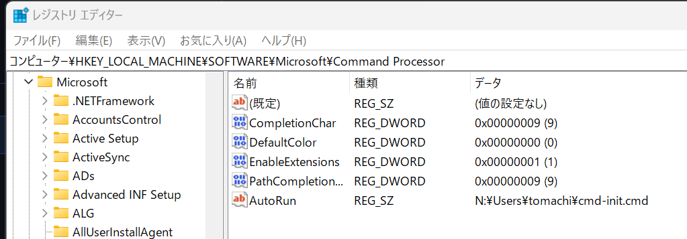

# fnm のインストール

Node.js のバージョンマネージャー、Fast Node Manager (fnm) をインストールする。

## 1. fnm 自体をインストール

[README の Installation](https://github.com/Schniz/fnm?tab=readme-ov-file#installation) を参考に、fnm をインストールする。

Scoop でのインストールであれば、以下で OK。

```powershell
scoop install fnm
```

## 2. PowerShell 起動時に初期化されるように設定

`code $PROFILE` などで、PowerShell のプロファイルファイルを開き、以下を記述。

```powershell
fnm env --corepack-enabled --use-on-cd --shell power-shell | Out-String | Invoke-Expression

# if .node-version file exists, use it to set the node version
if (Test-Path .node-version) {
    fnm install
}
```

## 3. CMD.exe 起動時に初期化されるように設定

以下を `cmd-init.cmd` として任意の場所に格納。

```bat
@ECHO OFF

IF "%MYSTARTUP_INIT%"=="OK" (
    EXIT /b
)

SET MYSTARTUP_INIT=OK

REM Setup fnm
FOR /f "tokens=*" %%z IN ('fnm env --use-on-cd --shell cmd') DO CALL %%z

if exist .node-version (
  cat .node-version | fnm use
)
```

レジストリエディタで、HKEY_LOCAL_MACHINE\SOFTWARE\Microsoft\Command Processor を開き、文字列型の AutoRun として作成した cmd ファイルへのパスを指定。

1. レジストリエディタ（`regedit`）を開く
2. `HKEY_LOCAL_MACHINE\SOFTWARE\Microsoft\Command Processor` に移動
3. `Command Processor` を右クリック
4. `新規` → `文字列型` から、`AutoRun` のキーを作成。
5. `AutoRun` をダブルクリックし、値のデータに先ほど作成した `cmd-init.cmd` へのフルパスを入力し `OK` をクリック。


