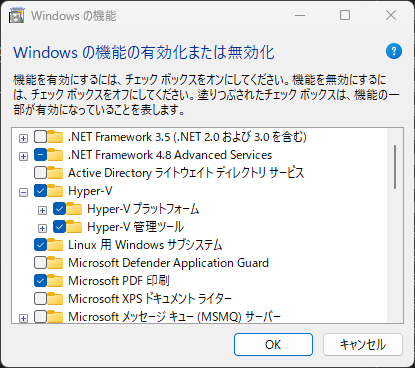

# 仮想システム系

Hyper-V とか Nox とか BlueStacks について。

## Hyper-V

Windows のなかで仮想マシンを動かすプラットフォーム。「ハードウェアの仮想化システム」と説明されることが多い。  
Windows のなかで Ubuntu を動かしたり、いろいろ試したいときに使えるやつ。

### Hyper-V の要件

Hyper-V を有効化するには、いくつかの要件がある。

- CPU が仮想化機能を持つこと。Intel VT や AMD-V がそれにあたる。
- OS が Windows Pro、Windows Enterprise、Windows Education であること

### Hyper-V を利用可能にする

有効化するには、いくつかの手順が必要。

### 1. BIOS から機能を有効化する

BIOS に入り、以下のような設定を有効化する。

- Intel: `Advanced` > `CPU Configuration` > `Intel(R) VirtualizationTechnology` > `[Enabled]`
- AMD: `Advanced` > `CPU Configuration` > `SVM` > `[Enabled]`

## 2. Hyper-V を有効化する

`Windows の機能の有効化または無効化`（`OptionalFeatures.exe`）にて、以下を有効化する。

- [x] Hyper-V
  - [x] Hyper-V プラットフォーム
  - [x] Hyper-V 管理ツール

再起動が求められたら再起動する。

## Windows SandBox

あんまり信用できないアプリケーションなどを試すのに利用できる、使い捨て環境（サンドボックス）。

Hyper-V が有効化されていれば Windows SandBox も利用可能なはず。

`Windows の機能の有効化または無効化`（`OptionalFeatures.exe`）にて、以下を有効化する。

- [x] Windows サンドボックス

## Windows Subsystem for Linux

- インストール手順（WSL2, Ubuntu）
- 移行作業手順

## Docker Desktop

- SSH Agent
- OpenSSL のアップデート

## Nox

[Nox と HyperV 共存させるには](https://support.bignox.com/ja/else/hypervonbeta) を参考に、Hyper-V との共存ができる…不安定だけど。

## BlueStacks

[BlueStacks のトップページ](https://www.bluestacks.com/) から **BlueStacks 5 を** ダウンロードして、インストール先を C ドライブ以外にしたうえでインストールする。  
`BlueStacks_nxt` というフォルダを勝手に作ってくるので、適当に古いやつと置き換えればマルチインスタンスマネージャーから起動できる。BlueStacks の**アプリケーション自体は C ドライブにインストール**される。

BlueStacks X を勝手にインストールしやがったら、Windows のアプリケーションと機能からアンインストールしたうえで [PC から BlueStacks 5 を十分にアンインストールする方法](https://support.bluestacks.com/hc/ja/articles/360057724751) を参考に完全アンインストールを実施したうえで再インストール。
