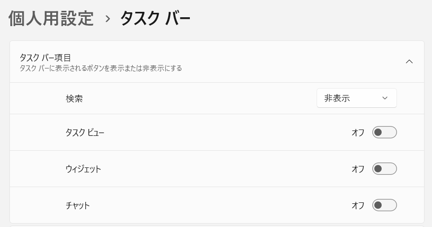
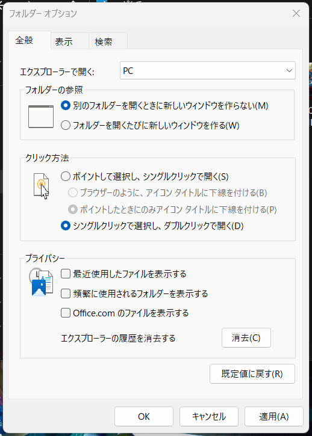
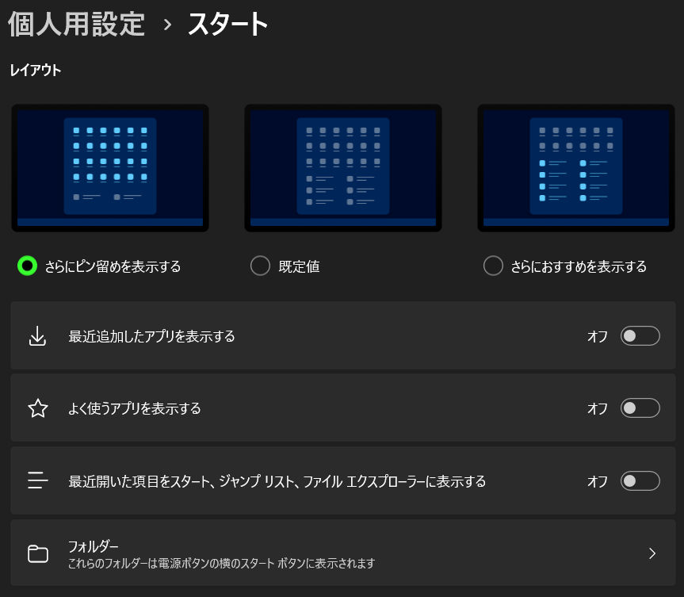

# 自分用 PC セットアップ関連メモ (Windows 11)

[Windows 10](win10-setup.md) | [Windows 11](win11-setup.md)

**本メモの内容に起因して、生じたあらゆる損害や障害について一切の責任を負いません。**

`<`, `>` で囲まれたものは置換する必要がある。記載されたコードは原則 PowerShell のコードなので、PowerShell で実行すること。コマンドプロンプトでは動作しない。

Windows 11 Home 22H2 (Build 22621.1702) にて実施。

## クリーンインストール前にやることメモ

- インストール済みアプリケーションのリストアップ
- ハード構成を変える場合は Microsoft アカウントへのログイン
- WSL2 のエクスポート

## インストール時の Microsoft アカウント必須回避

- 参考: https://a-zs.net/win11_msaccountkaihi/

Microsoft アカウント必須化まわりの仕様がセットアップするごとに変わっているので難しいが、とりあえず以下の手順で回避可能。  
Windows 11 Home でも利用可能な手順であることを確認済み。

1. Windows 11 のインストール完了後、言語の選択画面になったことを確認
2. ++shift+f10++ を押して、コマンドプロンプトを開く
3. `oobe\ByPassNRO.cmd` を入力し実行。自動で再起動する
4. セットアップを進めると、ネットワーク接続画面で「インターネットに接続していません」というボタンが利用できるようになる。こちらをクリック
5. 「今すぐ接続して、デバイスをすぐに使い始めましょう」という画面が出るが、「制限された設定で続行」をクリック

この手順を踏むことで、ローカルアカウントにて利用可能。  
ローカルアカウント名は全角・半角を識別する（同一名でユーザーフォルダが作成される）ので注意（小文字の方が多分良い）。

### Windows 10 と変わらない点

以下については、Windows 10 から変わっていない。これらについては Windows 10 でのセットアップ手順を参照（将来的にはページ統合）。

- [デバイス名の変更](win10-setup.md#_3)
- [各種ブラウザインストール](win10-setup.md#_4)
- [アンチウイルスソフトのインストール](win10-setup.md#_5)
- [OneDrive をエクスプローラーに表示させないようにする](win10-setup.md#onedrive)
- [Scoop のインストール・移行](win10-setup.md#scoop)
- [Pwsh (PowerShell) のインストール](win10-setup.md#pwsh-powershell)
- [Starship・HackGenNerd のインストール](win10-setup.md#starshiphackgennerd)
- [Win + X 画面の編集](win10-setup.md#win-x)
- [fnm のインストール](win10-setup.md#fnm)
- [Logicool G Hub の設定移行](win10-setup.md#logicool-g-hub)
- [その他アプリケーションのインストール](win10-setup.md#_15)
- [スタートアップの設定](win10-setup.md#_16)
- [仮想系のセットアップ](win10-setup.md#_17)
- [Becky](win10-setup.md#becky)
- [そのほか利便性向上のための設定](win10-setup.md#_18)

## ダークモード化など

設定アプリにて、`個人用設定` にて好きなテーマや色を選択。

## タスクバーまわりの設定

次の設定を変更する。

- 不要なボタンなど（検索・タスクビュー・ウィジェット・チャット）を非表示にする
- 中央揃えになっているタスクバーを左に寄せる

### 不要なボタンなどを非表示にする



設定アプリにて、`個人用設定` → `タスク バー` に進み、以下を変更。

- `タスク バー項目`
  - `検索`: **非表示**
  - `タスク ビュー`: **オフ**
  - `ウィジェット`: **オフ**
  - `チャット`: **オフ**

### 中央揃えになっているタスクバーを左に寄せる


設定アプリにて、`個人用設定` → `タスク バー` に進み、`タスク バーの動作` にて `タスク バーの配置` を「左揃え」に変更。

### ちなみに: タスクバーの横移動

レジストリでいじれるけど、アプリケーション表示がおかしくなるので横にするのはやめた方がよい。上はできる。

## エクスプローラーのカスタマイズ

エクスプローラーについて、以下の設定をする。

- エクスプローラーを開いた際に、`PC` を表示するようにする
- クイックアクセスにて、`最近使ったファイル` は表示しない
- クイックアクセスにて、`よく使うフォルダー` は表示しない
- 拡張子を表示する
- 隠しファイルを表示する



エクスプローラーを開き、上部 `...` から `オプション` を開く。

### `全般` タブ

- エクスプローラーで開く: `PC`

#### `プライバシー`

- [ ] `最近使用したファイルを表示する`
- [ ] `頻繁に使用されるフォルダーを表示する`
- [ ] `Office.com のファイルを表示する`

### `表示` タブ

#### `ファイルおよびフォルダー`

- [x] `隠しファイル、隠しフォルダー、および隠しファイルを表示する`
- [ ] `登録されている拡張子は表示しない`

## スタートメニューのカスタマイズ

スタートメニューについて、以下の設定をする。

- ピン留めを表示する件数を増やす
- 最近追加したアプリを表示しない
- よく使うアプリを表示しない
- 最近開いた項目を表示しない



設定アプリにて、`個人用設定` → `スタート` に進み、以下を変更。

- `レイアウト`: **さらにピン留めを表示する**
- `最近追加したアプリを表示する`: オフ
- `よく使うアプリを表示する`: オフ
- `最近開いた項目をスタート、ジャンプ リスト、ファイル エクスプローラーに表示する`: オフ

## デスクトップ・ドキュメント・ピクチャフォルダ

インストール時に Microsoft アカウントを入れると OneDrive 上に置かれる。  
そのままでは移動できないので、レジストリをいじって移動するしかない。

なお、desktop.ini を移動しないとローカライズされないので移動すること。

それぞれのフォルダの参照先変更は Windows 10 と同様なので、そちらを参照: [ユーザーフォルダの移動](win10-setup.md#_14)

## ファイルなどの右クリックメニューを戻す

1. レジストリエディタ（`regedit`）を開く
2. `HKEY_CURRENT_USER\Software\Classes\CLSID` に移動
3. `CLSID` を右クリック
4. `新規` → `キー` から、`{86ca1aa0-34aa-4e8b-a509-50c905bae2a2}` のキーを作成。
5. 作成したキー `{86ca1aa0-34aa-4e8b-a509-50c905bae2a2}` を右クリックし、`新規` → `キー` から、`InprocServer32` を作成。
6. PC を再起動（エクスプローラー再起動では不可）

https://pc-karuma.net/right-click-context-menu-back-on-windows-11/

### Win11 の標準アプリケーションを削除

[Windows11 の標準アプリをまとめてアンインストール(削除)する方法#まとめて消す（まとめて消す）](https://ygkb.jp/22500#delete-all) を参考に、PowerShell で一括アンインストールを行う。  
ただし、この作業だけでは消えないものもあるのでスタートメニューから必要に応じて削除  
ここで消してしまっても Microsoft Store からインストール可能。

??? tip "PowerShell コード引用"

    ```powershell
    Get-AppxPackage Clipchamp.Clipchamp | Remove-AppxPackage                       # Clipchamp
    Get-AppxPackage Microsoft.549981C3F5F10 | Remove-AppxPackage                   # Cortana
    Get-AppxPackage Disney.37853FC22B2CE | Remove-AppxPackage                      # Disney+
    Get-AppxPackage MicrosoftTeams | Remove-AppxPackage                            # Microsoft Teams
    Get-AppxPackage Microsoft.Todos | Remove-AppxPackage                           # Microsoft To Do
    Get-AppxPackage Microsoft.MicrosoftOfficeHub | Remove-AppxPackage              # Office on the Webへようこそ
    Get-AppxPackage Microsoft.MicrosoftSolitaireCollection | Remove-AppxPackage    # Solitaire
    Get-AppxPackage SpotifyAB.SpotifyMusic | Remove-AppxPackage                    # Spotify
    Get-AppxPackage Microsoft.GamingApp | Remove-AppxPackage                       # Xbox ストア画面
    Get-AppxPackage Microsoft.XboxGamingOverlay | Remove-AppxPackage               # Xbox Game Bar
    Get-AppxPackage Microsoft.Xbox.TCUI | Remove-AppxPackage                       # Xbox その他
    Get-AppxPackage Microsoft.XboxGameOverlay | Remove-AppxPackage                 # Xbox その他
    Get-AppxPackage Microsoft.XboxIdentityProvider | Remove-AppxPackage            # Xbox その他
    Get-AppxPackage Microsoft.XboxSpeechToTextOverlay | Remove-AppxPackage         # Xbox その他
    Get-AppxPackage Microsoft.ZuneVideo | Remove-AppxPackage                       # 映画 & テレビ
    # Get-AppxPackage Microsoft.WindowsCamera | Remove-AppxPackage                   # カメラ
    Get-AppxPackage Microsoft.WindowsAlarms | Remove-AppxPackage                   # クロック
    Get-AppxPackage Microsoft.YourPhone | Remove-AppxPackage                       # スマホ同期
    Get-AppxPackage Microsoft.BingWeather | Remove-AppxPackage                     # 天気
    Get-AppxPackage Microsoft.Getstarted | Remove-AppxPackage                      # ヒント
    Get-AppxPackage Microsoft.WindowsFeedbackHub | Remove-AppxPackage              # フィードバック Hub
    # Get-AppxPackage Microsoft.Windows.Photos | Remove-AppxPackage                  # フォト
    # Get-AppxPackage Microsoft.MicrosoftStickyNotes | Remove-AppxPackage            # 付箋
    Get-AppxPackage Microsoft.WindowsSoundRecorder | Remove-AppxPackage            # ボイス レコーダー
    Get-AppxPackage Microsoft.WindowsMaps | Remove-AppxPackage                     # マップ
    Get-AppxPackage microsoft.windowscommunicationsapps | Remove-AppxPackage       # メール、カレンダー
    Get-AppxPackage Microsoft.ZuneMusic | Remove-AppxPackage                       # メディアプレーヤー
    ```

上記に追加で、以下もいらないかも。

```powershell
Get-AppxPackage Microsoft.BingNew | Remove-AppxPackage
Get-AppxPackage Microsoft.BingNews | Remove-AppxPackage
Get-AppxPackage Microsoft.GetHelp | Remove-AppxPackage
Get-AppxPackage Microsoft.People | Remove-AppxPackage
```
